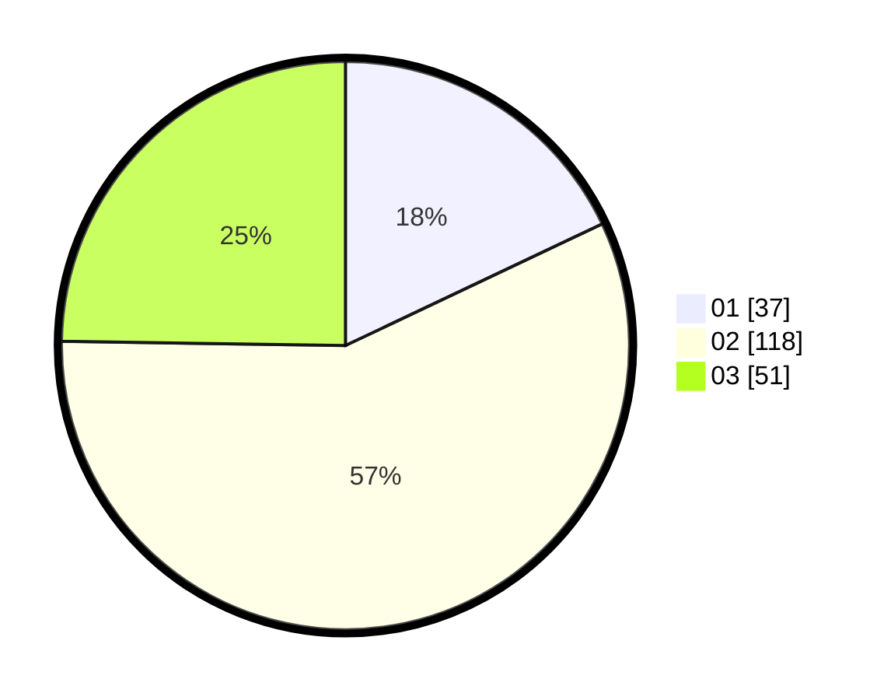

# Hasil

Hasil perolehan suara paslon dapat dilihat pada file paslon-01.txt, paslon-02.txt, dan paslon-03.txt.

Jika tidak ada, artinya data tersebut belum ada pada SIREKAP.

## Perolehan Suara

 * Paslon 01: **37**.
 * Paslon 02: **118**.
 * Paslon 03: **51**.

## Foto C Plano

https://sirekap-obj-formc.kpu.go.id/9a32/pemilu/ppwp/31/72/05/10/02/3172051002149-20240214-195128--632b8453-cd2a-4b3e-8d7c-7428bbff8ea2.jpg

https://sirekap-obj-formc.kpu.go.id/9a32/pemilu/ppwp/31/72/05/10/02/3172051002149-20240214-195240--7fac5e69-60ce-499c-bb8f-2a0bf7d8d100.jpg

https://sirekap-obj-formc.kpu.go.id/9a32/pemilu/ppwp/31/72/05/10/02/3172051002149-20240214-195331--ba7e468b-4997-44ee-b3eb-d246af301e69.jpg

## DATA PEMILIH TETAP

Jumlah pemilih dalam DPT: **224**.
 * L: **111**.
 * P: **113**.

## DATA PENGGUNA HAK PILIH

Jumlah pengguna hak pilih dalam DPT: **137**.
 * L: **67**.
 * P: **70**.

Jumlah pengguna hak pilih dalam DPTb: **11**.
 * L: **3**.
 * P: **8**.

Jumlah pengguna hak pilih dalam DPK: **59**.
 * L: **34**.
 * P: **25**.

Jumlah pengguna hak pilih: **207**.
 * L: **104**.
 * P: **103**.

## JUMLAH SUARA SAH DAN TIDAK SAH

JUMLAH SELURUH SUARA SAH: **206**.

JUMLAH SUARA TIDAK SAH: **1**.

JUMLAH SELURUH SUARA SAH DAN SUARA TIDAK SAH: **207**.
