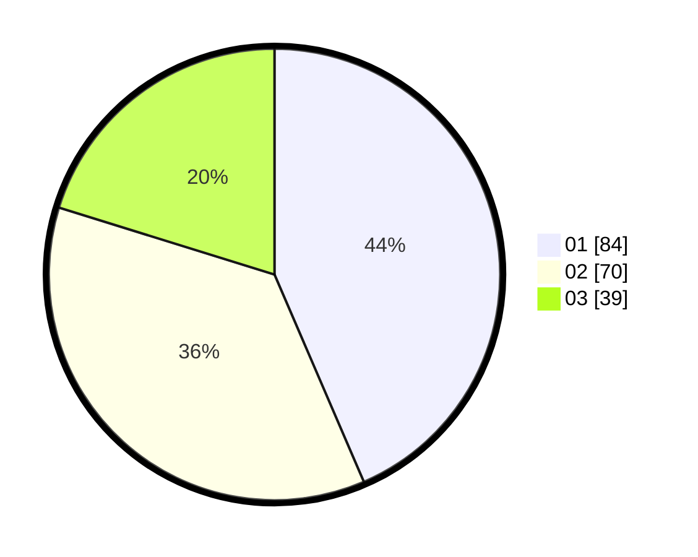

# Hasil

Hasil perolehan suara paslon dapat dilihat pada file paslon-01.txt, paslon-02.txt, dan paslon-03.txt.

Jika tidak ada, artinya data tersebut belum ada pada SIREKAP.

## Perolehan Suara

 * Paslon 01: **84**.
 * Paslon 02: **70**.
 * Paslon 03: **39**.

## Foto C Plano

https://sirekap-obj-formc.kpu.go.id/dfd8/pemilu/ppwp/31/72/05/10/02/3172051002158-20240218-220022--caa6a247-c0bc-4c54-8244-6ac0b8a34883.jpg

https://sirekap-obj-formc.kpu.go.id/dfd8/pemilu/ppwp/31/72/05/10/02/3172051002158-20240214-212127--4ee4d4f8-8e35-4c5c-8158-0e51b6586cb7.jpg

https://sirekap-obj-formc.kpu.go.id/dfd8/pemilu/ppwp/31/72/05/10/02/3172051002158-20240217-134603--775eed69-e32a-4943-8473-eb46f4d80c8b.jpg
