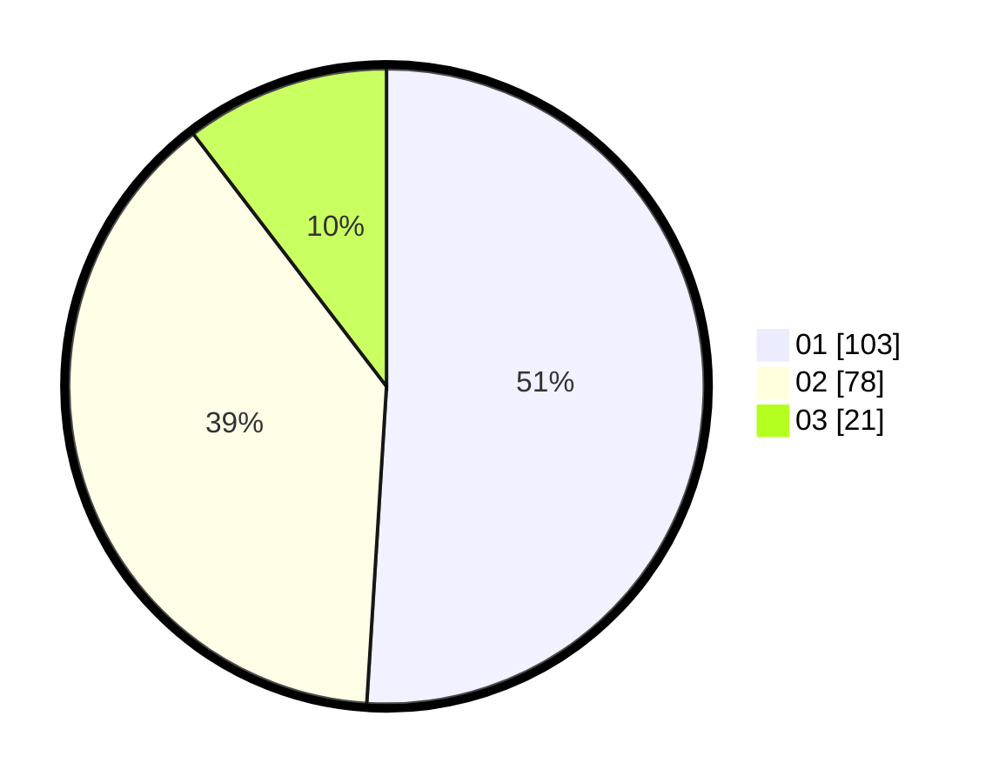

# Hasil

Hasil perolehan suara paslon dapat dilihat pada file paslon-01.txt, paslon-02.txt, dan paslon-03.txt.

Jika tidak ada, artinya data tersebut belum ada pada SIREKAP.

## Perolehan Suara

 * Paslon 01: **103**.
 * Paslon 02: **78**.
 * Paslon 03: **21**.

## Foto C Plano

https://sirekap-obj-formc.kpu.go.id/3adc/pemilu/ppwp/31/72/05/10/02/3172051002170-20240215-064353--892452d3-ac5b-46c2-a5a3-d9476d3ea8da.jpg

https://sirekap-obj-formc.kpu.go.id/3adc/pemilu/ppwp/31/72/05/10/02/3172051002170-20240215-064416--ab6f5c5c-c531-48a7-9b2b-0c0171c7190c.jpg

https://sirekap-obj-formc.kpu.go.id/3adc/pemilu/ppwp/31/72/05/10/02/3172051002170-20240215-064440--1147c482-18d1-4dcd-a95b-b4f562ea34eb.jpg
