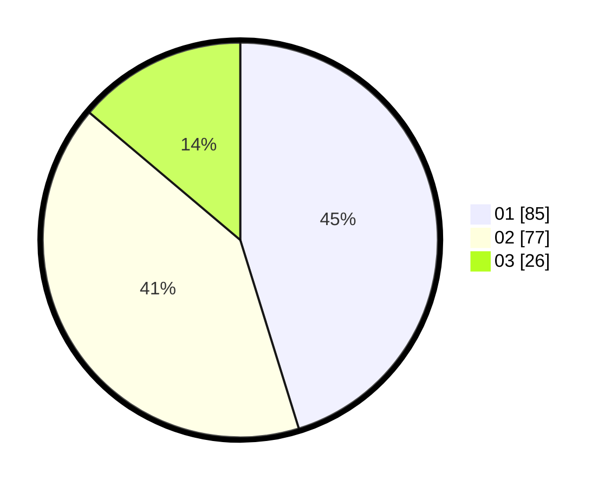

# Hasil

Hasil perolehan suara paslon dapat dilihat pada file paslon-01.txt, paslon-02.txt, dan paslon-03.txt.

Jika tidak ada, artinya data tersebut belum ada pada SIREKAP.

## Perolehan Suara

 * Paslon 01: **85**.
 * Paslon 02: **77**.
 * Paslon 03: **26**.

## Foto C Plano

https://sirekap-obj-formc.kpu.go.id/5175/pemilu/ppwp/31/72/05/10/02/3172051002180-20240215-000623--4be7e617-4de7-46ad-abaa-89ee572de271.jpg

https://sirekap-obj-formc.kpu.go.id/5175/pemilu/ppwp/31/72/05/10/02/3172051002180-20240214-193428--52fb803d-a8d1-4f81-b434-4a0ff26f9f01.jpg

https://sirekap-obj-formc.kpu.go.id/5175/pemilu/ppwp/31/72/05/10/02/3172051002180-20240215-000954--f50aec5a-4b2e-4e73-90c8-ed3105be34a5.jpg
