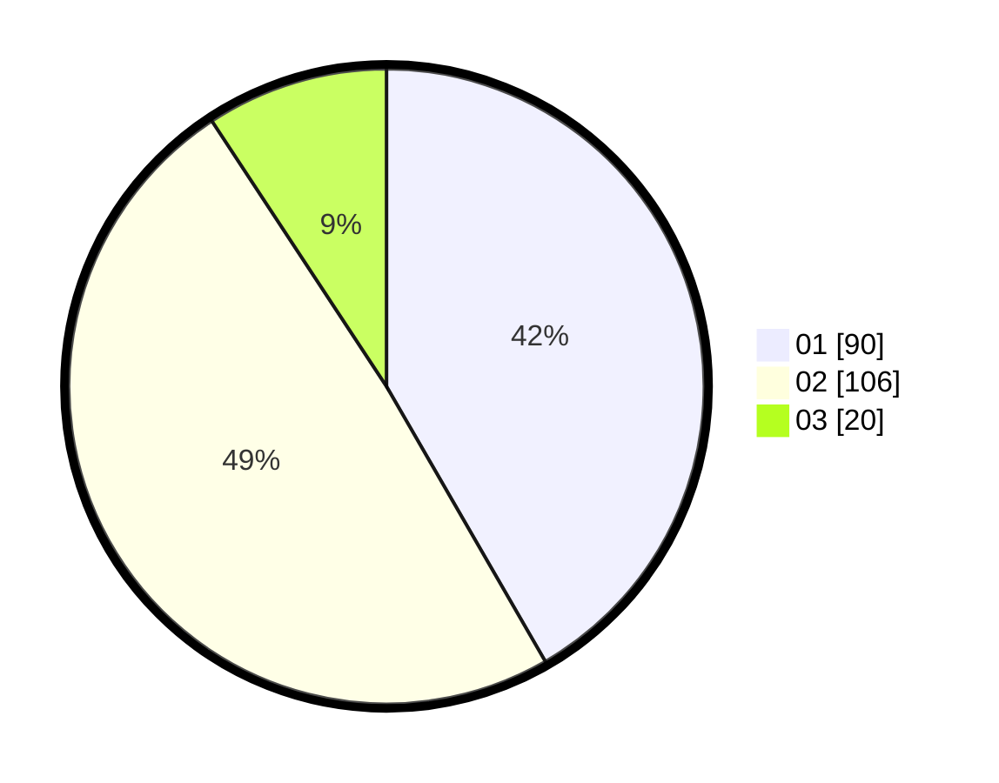

# Hasil

Hasil perolehan suara paslon dapat dilihat pada file paslon-01.txt, paslon-02.txt, dan paslon-03.txt.

Jika tidak ada, artinya data tersebut belum ada pada SIREKAP.

## Perolehan Suara

 * Paslon 01: **90**.
 * Paslon 02: **106**.
 * Paslon 03: **20**.

## Foto C Plano

https://sirekap-obj-formc.kpu.go.id/3ce5/pemilu/ppwp/31/72/05/10/02/3172051002183-20240214-200934--5253855e-3e0f-40e4-ab69-4a370b91281e.jpg

https://sirekap-obj-formc.kpu.go.id/3ce5/pemilu/ppwp/31/72/05/10/02/3172051002183-20240214-195405--30487490-297c-4823-aeb4-5862b6b49adf.jpg

https://sirekap-obj-formc.kpu.go.id/3ce5/pemilu/ppwp/31/72/05/10/02/3172051002183-20240214-195617--5b169c56-f0f1-4cf1-802f-6548692f2102.jpg
