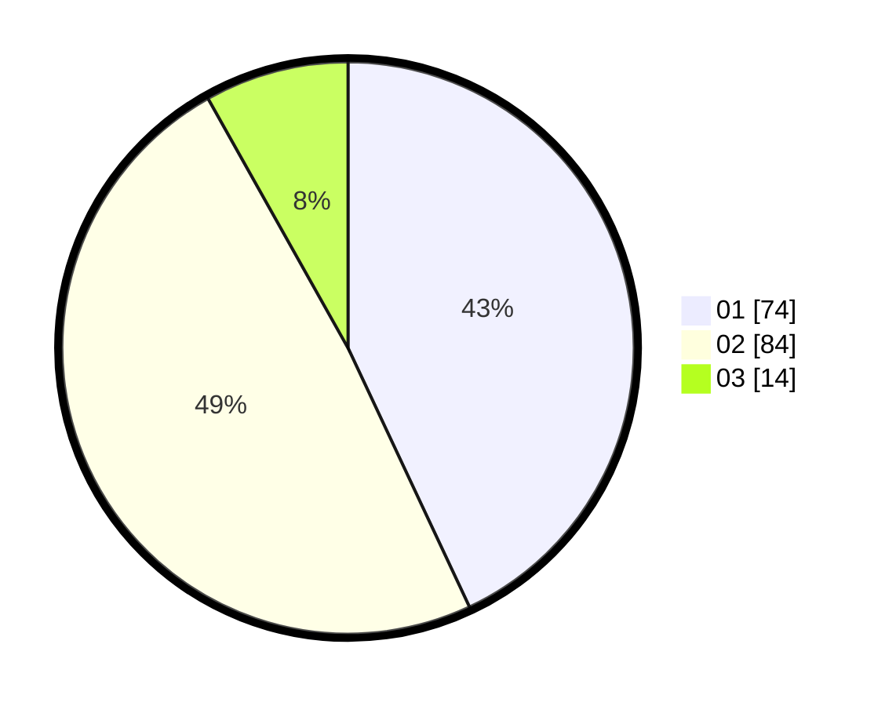

# Hasil

Hasil perolehan suara paslon dapat dilihat pada file paslon-01.txt, paslon-02.txt, dan paslon-03.txt.

Jika tidak ada, artinya data tersebut belum ada pada SIREKAP.

## Perolehan Suara

 * Paslon 01: **74**.
 * Paslon 02: **84**.
 * Paslon 03: **14**.

## Foto C Plano

https://sirekap-obj-formc.kpu.go.id/8b81/pemilu/ppwp/31/72/05/10/02/3172051002186-20240214-214946--f4278687-740a-47e3-847e-5624b86dbf89.jpg

https://sirekap-obj-formc.kpu.go.id/8b81/pemilu/ppwp/31/72/05/10/02/3172051002186-20240216-093222--cd47f6a1-cfc2-40b6-a657-dc58a073fcea.jpg

https://sirekap-obj-formc.kpu.go.id/8b81/pemilu/ppwp/31/72/05/10/02/3172051002186-20240216-093217--37e962b7-50b0-431d-a4de-e9abd4e829b3.jpg

## DATA PEMILIH TETAP

Jumlah pemilih dalam DPT: **282**.
 * L: **138**.
 * P: **144**.

## DATA PENGGUNA HAK PILIH

Jumlah pengguna hak pilih dalam DPT: **173**.
 * L: **87**.
 * P: **86**.

Jumlah pengguna hak pilih dalam DPTb: **0**.
 * L: **0**.
 * P: **0**.

Jumlah pengguna hak pilih dalam DPK: **0**.
 * L: **0**.
 * P: **0**.

Jumlah pengguna hak pilih: **173**.
 * L: **87**.
 * P: **86**.

## JUMLAH SUARA SAH DAN TIDAK SAH

JUMLAH SELURUH SUARA SAH: **172**.

JUMLAH SUARA TIDAK SAH: **1**.

JUMLAH SELURUH SUARA SAH DAN SUARA TIDAK SAH: **173**.
