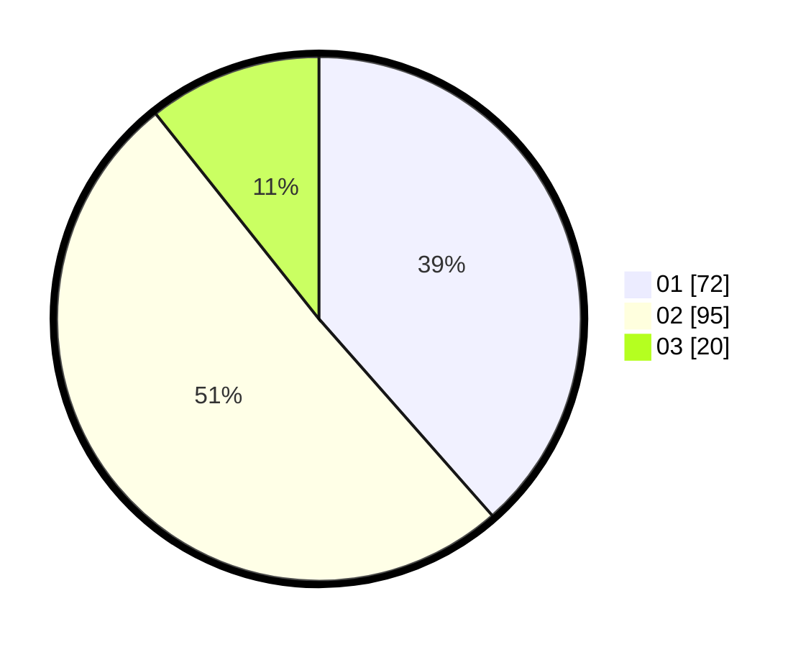

# Hasil

Hasil perolehan suara paslon dapat dilihat pada file paslon-01.txt, paslon-02.txt, dan paslon-03.txt.

Jika tidak ada, artinya data tersebut belum ada pada SIREKAP.

## Perolehan Suara

 * Paslon 01: **72**.
 * Paslon 02: **95**.
 * Paslon 03: **20**.

## Foto C Plano

https://sirekap-obj-formc.kpu.go.id/3860/pemilu/ppwp/31/72/05/10/02/3172051002187-20240214-221127--d5a3de9a-5cfc-4b70-be2c-923cf52a467b.jpg

https://sirekap-obj-formc.kpu.go.id/3860/pemilu/ppwp/31/72/05/10/02/3172051002187-20240214-221227--06c9f60d-f61e-424a-8ebf-be5cb2f1738d.jpg

https://sirekap-obj-formc.kpu.go.id/3860/pemilu/ppwp/31/72/05/10/02/3172051002187-20240214-221343--38eef2d6-b8bc-47a6-8274-6b41171f870d.jpg

## DATA PEMILIH TETAP

Jumlah pemilih dalam DPT: **278**.
 * L: **143**.
 * P: **135**.

## DATA PENGGUNA HAK PILIH

Jumlah pengguna hak pilih dalam DPT: **188**.
 * L: **88**.
 * P: **100**.

Jumlah pengguna hak pilih dalam DPTb: **3**.
 * L: **1**.
 * P: **2**.

Jumlah pengguna hak pilih dalam DPK: **0**.
 * L: **0**.
 * P: **0**.

Jumlah pengguna hak pilih: **191**.
 * L: **89**.
 * P: **102**.

## JUMLAH SUARA SAH DAN TIDAK SAH

JUMLAH SELURUH SUARA SAH: **187**.

JUMLAH SUARA TIDAK SAH: **4**.

JUMLAH SELURUH SUARA SAH DAN SUARA TIDAK SAH: **191**.
