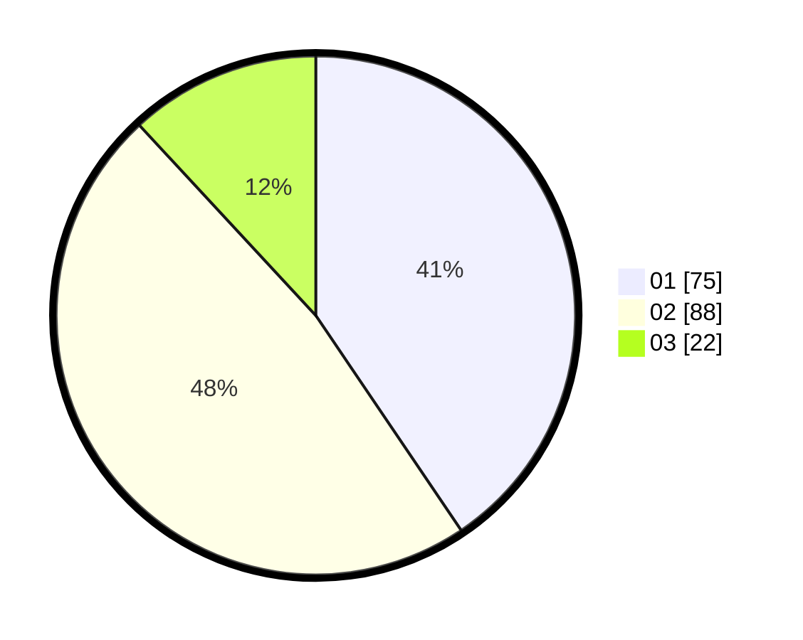

# Hasil

Hasil perolehan suara paslon dapat dilihat pada file paslon-01.txt, paslon-02.txt, dan paslon-03.txt.

Jika tidak ada, artinya data tersebut belum ada pada SIREKAP.

## Perolehan Suara

 * Paslon 01: **75**.
 * Paslon 02: **88**.
 * Paslon 03: **22**.

## Foto C Plano

https://sirekap-obj-formc.kpu.go.id/8fc7/pemilu/ppwp/31/72/05/10/02/3172051002188-20240215-193056--783e4fd1-9a49-421d-9e86-5d246a0e0f24.jpg

https://sirekap-obj-formc.kpu.go.id/8fc7/pemilu/ppwp/31/72/05/10/02/3172051002188-20240214-224623--97740e09-0b95-4ffa-9840-b97a0a4c14dd.jpg

https://sirekap-obj-formc.kpu.go.id/8fc7/pemilu/ppwp/31/72/05/10/02/3172051002188-20240214-224630--495d81f6-b192-43e4-807c-cef3df2f98a9.jpg
