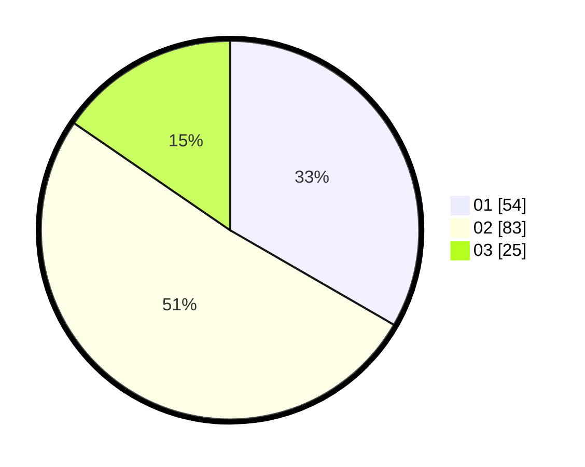

# Hasil

Hasil perolehan suara paslon dapat dilihat pada file paslon-01.txt, paslon-02.txt, dan paslon-03.txt.

Jika tidak ada, artinya data tersebut belum ada pada SIREKAP.

## Perolehan Suara

 * Paslon 01: **54**.
 * Paslon 02: **83**.
 * Paslon 03: **25**.

## Foto C Plano

https://sirekap-obj-formc.kpu.go.id/ce59/pemilu/ppwp/31/72/05/10/02/3172051002224-20240215-012632--35dc4485-fef4-4007-9c84-fc54f65c133f.jpg

https://sirekap-obj-formc.kpu.go.id/ce59/pemilu/ppwp/31/72/05/10/02/3172051002224-20240215-012811--ec0c8de8-d891-4c65-8ff3-3aed2f19841d.jpg

https://sirekap-obj-formc.kpu.go.id/ce59/pemilu/ppwp/31/72/05/10/02/3172051002224-20240215-013101--1dad1c84-f13f-48cc-8eb5-664ef4458ac4.jpg

## DATA PEMILIH TETAP

Jumlah pemilih dalam DPT: **211**.
 * L: **107**.
 * P: **104**.

## DATA PENGGUNA HAK PILIH

Jumlah pengguna hak pilih dalam DPT: **164**.
 * L: **80**.
 * P: **84**.

Jumlah pengguna hak pilih dalam DPTb: **0**.
 * L: **0**.
 * P: **0**.

Jumlah pengguna hak pilih dalam DPK: **0**.
 * L: **0**.
 * P: **0**.

Jumlah pengguna hak pilih: **164**.
 * L: **80**.
 * P: **84**.

## JUMLAH SUARA SAH DAN TIDAK SAH

JUMLAH SELURUH SUARA SAH: **162**.

JUMLAH SUARA TIDAK SAH: **2**.

JUMLAH SELURUH SUARA SAH DAN SUARA TIDAK SAH: **164**.
