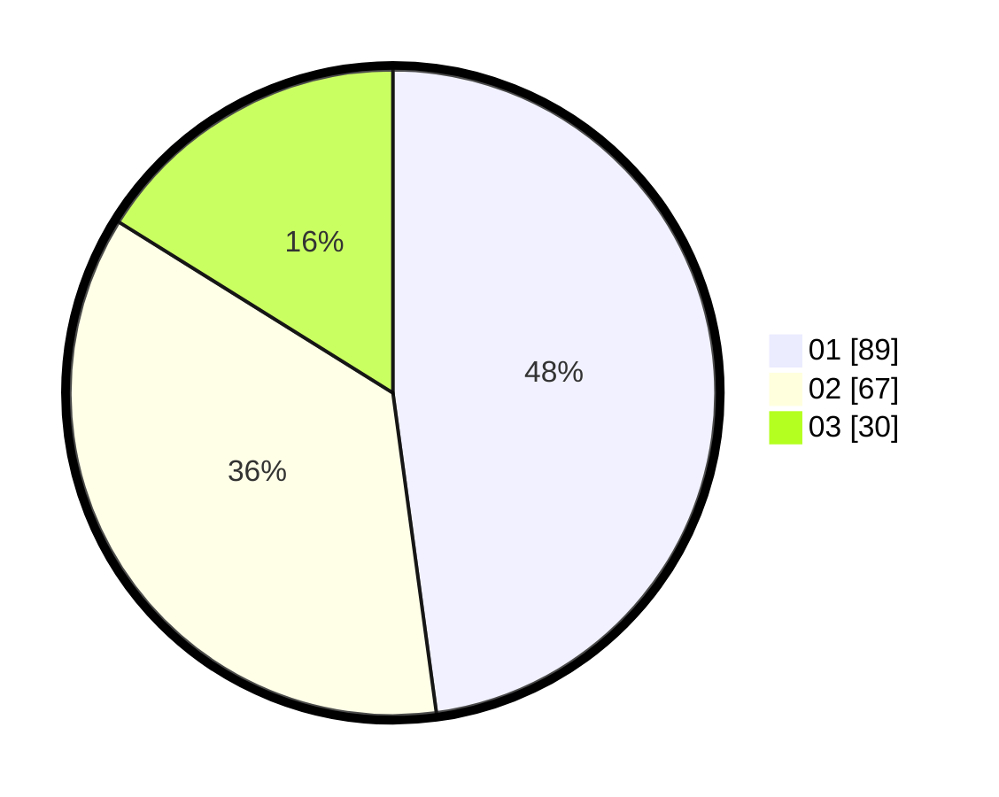

# Hasil

Hasil perolehan suara paslon dapat dilihat pada file paslon-01.txt, paslon-02.txt, dan paslon-03.txt.

Jika tidak ada, artinya data tersebut belum ada pada SIREKAP.

## Perolehan Suara

 * Paslon 01: **89**.
 * Paslon 02: **67**.
 * Paslon 03: **30**.

## Foto C Plano

https://sirekap-obj-formc.kpu.go.id/7843/pemilu/ppwp/31/72/05/10/02/3172051002227-20240214-191936--25a2858b-7d96-4d06-8f31-7ed6cfea619d.jpg

https://sirekap-obj-formc.kpu.go.id/7843/pemilu/ppwp/31/72/05/10/02/3172051002227-20240214-191941--0123b500-3bed-4e42-b39d-da6eaa08e380.jpg

https://sirekap-obj-formc.kpu.go.id/7843/pemilu/ppwp/31/72/05/10/02/3172051002227-20240215-204742--c31435e8-2de1-4de7-be1e-15f400b7154f.jpg

## DATA PEMILIH TETAP

Jumlah pemilih dalam DPT: **260**.
 * L: **147**.
 * P: **113**.

## DATA PENGGUNA HAK PILIH

Jumlah pengguna hak pilih dalam DPT: **181**.
 * L: **95**.
 * P: **86**.

Jumlah pengguna hak pilih dalam DPTb: **0**.
 * L: **0**.
 * P: **0**.

Jumlah pengguna hak pilih dalam DPK: **8**.
 * L: **2**.
 * P: **6**.

Jumlah pengguna hak pilih: **189**.
 * L: **97**.
 * P: **92**.

## JUMLAH SUARA SAH DAN TIDAK SAH

JUMLAH SELURUH SUARA SAH: **186**.

JUMLAH SUARA TIDAK SAH: **3**.

JUMLAH SELURUH SUARA SAH DAN SUARA TIDAK SAH: **189**.
