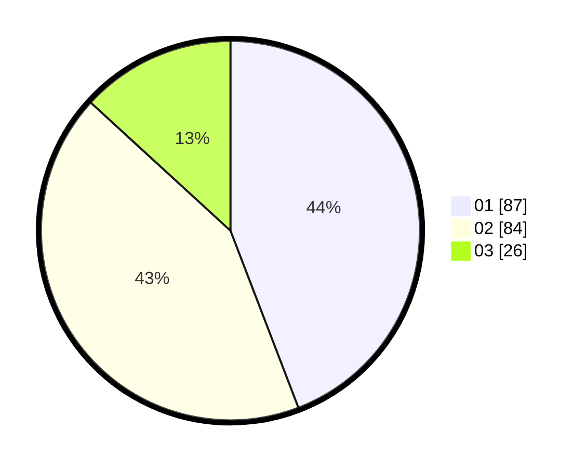

# Hasil

Hasil perolehan suara paslon dapat dilihat pada file paslon-01.txt, paslon-02.txt, dan paslon-03.txt.

Jika tidak ada, artinya data tersebut belum ada pada SIREKAP.

## Perolehan Suara

 * Paslon 01: **87**.
 * Paslon 02: **84**.
 * Paslon 03: **26**.

## Foto C Plano

https://sirekap-obj-formc.kpu.go.id/2120/pemilu/ppwp/31/72/05/10/03/3172051003002-20240217-104519--9b9977f8-79c9-4bb2-bfec-9a040c1111ce.jpg

https://sirekap-obj-formc.kpu.go.id/2120/pemilu/ppwp/31/72/05/10/03/3172051003002-20240217-104702--3c28fe26-2f15-4b99-b126-f30601d7f17f.jpg

https://sirekap-obj-formc.kpu.go.id/2120/pemilu/ppwp/31/72/05/10/03/3172051003002-20240217-104737--feab47ae-a386-433f-803d-4987fcaf2005.jpg
