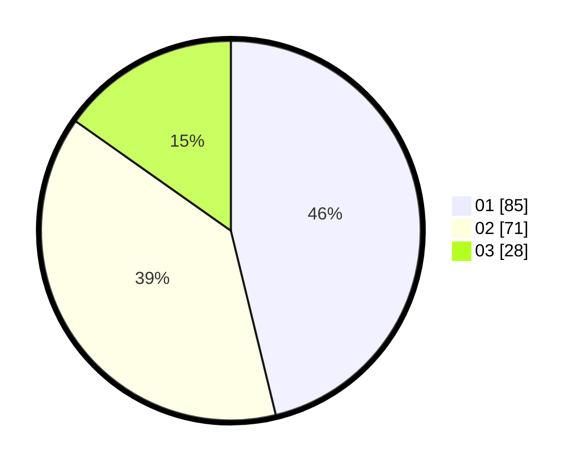

# Hasil

Hasil perolehan suara paslon dapat dilihat pada file paslon-01.txt, paslon-02.txt, dan paslon-03.txt.

Jika tidak ada, artinya data tersebut belum ada pada SIREKAP.

## Perolehan Suara

 * Paslon 01: **85**.
 * Paslon 02: **71**.
 * Paslon 03: **28**.

## Foto C Plano

https://sirekap-obj-formc.kpu.go.id/598a/pemilu/ppwp/31/72/05/10/03/3172051003009-20240214-233707--dbb7aafe-a8c6-4489-8cae-c9ed527e20d2.jpg

https://sirekap-obj-formc.kpu.go.id/598a/pemilu/ppwp/31/72/05/10/03/3172051003009-20240214-233801--5d66a8aa-f9db-466f-9ff0-4554fff222d2.jpg

https://sirekap-obj-formc.kpu.go.id/598a/pemilu/ppwp/31/72/05/10/03/3172051003009-20240216-115355--f5f25a16-a2b4-458d-adc3-92d9c304f0b3.jpg

## DATA PEMILIH TETAP

Jumlah pemilih dalam DPT: **258**.
 * L: **147**.
 * P: **111**.

## DATA PENGGUNA HAK PILIH

Jumlah pengguna hak pilih dalam DPT: **189**.
 * L: **99**.
 * P: **90**.

Jumlah pengguna hak pilih dalam DPTb: **0**.
 * L: **0**.
 * P: **0**.

Jumlah pengguna hak pilih dalam DPK: **0**.
 * L: **0**.
 * P: **0**.

Jumlah pengguna hak pilih: **189**.
 * L: **99**.
 * P: **90**.

## JUMLAH SUARA SAH DAN TIDAK SAH

JUMLAH SELURUH SUARA SAH: **184**.

JUMLAH SUARA TIDAK SAH: **5**.

JUMLAH SELURUH SUARA SAH DAN SUARA TIDAK SAH: **189**.
