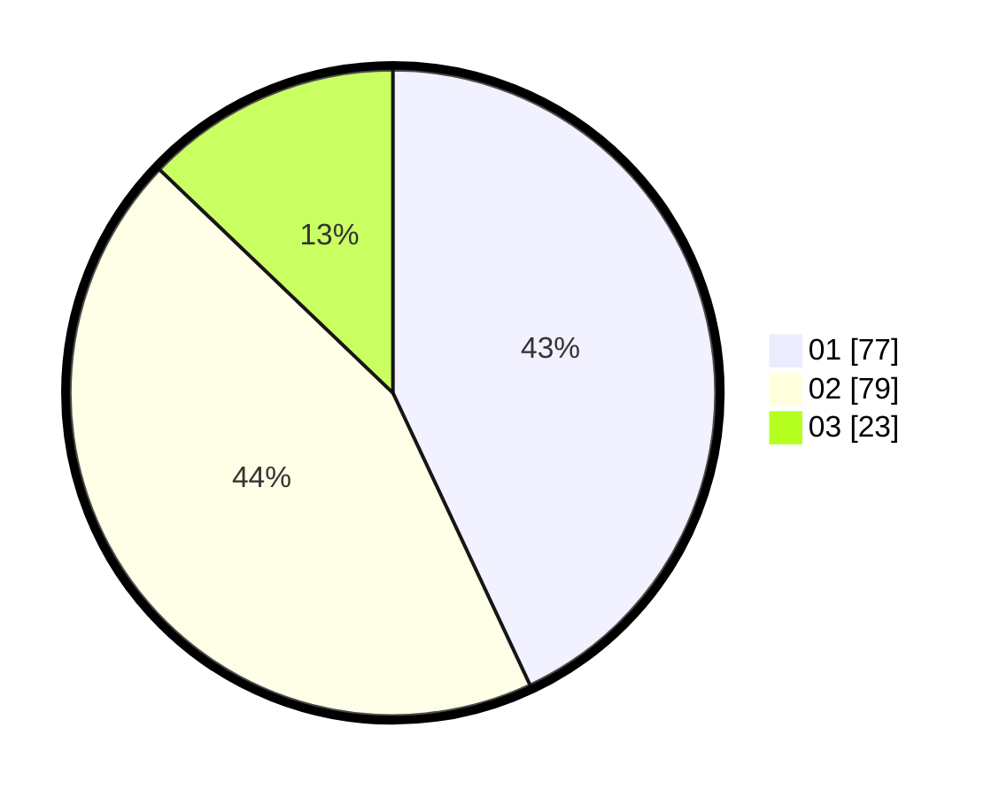

# Hasil

Hasil perolehan suara paslon dapat dilihat pada file paslon-01.txt, paslon-02.txt, dan paslon-03.txt.

Jika tidak ada, artinya data tersebut belum ada pada SIREKAP.

## Perolehan Suara

 * Paslon 01: **77**.
 * Paslon 02: **79**.
 * Paslon 03: **23**.

## Foto C Plano

https://sirekap-obj-formc.kpu.go.id/03da/pemilu/ppwp/31/72/05/10/03/3172051003010-20240214-185319--cc4edfb1-af04-475f-821d-920fc2e3232c.jpg

https://sirekap-obj-formc.kpu.go.id/03da/pemilu/ppwp/31/72/05/10/03/3172051003010-20240214-224244--9299adac-7a2f-4770-ba1c-33a7e81f84d5.jpg

https://sirekap-obj-formc.kpu.go.id/03da/pemilu/ppwp/31/72/05/10/03/3172051003010-20240219-094659--85e75bfe-e7e6-41f1-931d-5ededf9949f7.jpg

## DATA PEMILIH TETAP

Jumlah pemilih dalam DPT: **254**.
 * L: **122**.
 * P: **132**.

## DATA PENGGUNA HAK PILIH

Jumlah pengguna hak pilih dalam DPT: **175**.
 * L: **113**.
 * P: **62**.

Jumlah pengguna hak pilih dalam DPTb: **0**.
 * L: **0**.
 * P: **0**.

Jumlah pengguna hak pilih dalam DPK: **5**.
 * L: **2**.
 * P: **3**.

Jumlah pengguna hak pilih: **180**.
 * L: **115**.
 * P: **65**.

## JUMLAH SUARA SAH DAN TIDAK SAH

JUMLAH SELURUH SUARA SAH: **179**.

JUMLAH SUARA TIDAK SAH: **1**.

JUMLAH SELURUH SUARA SAH DAN SUARA TIDAK SAH: **180**.
