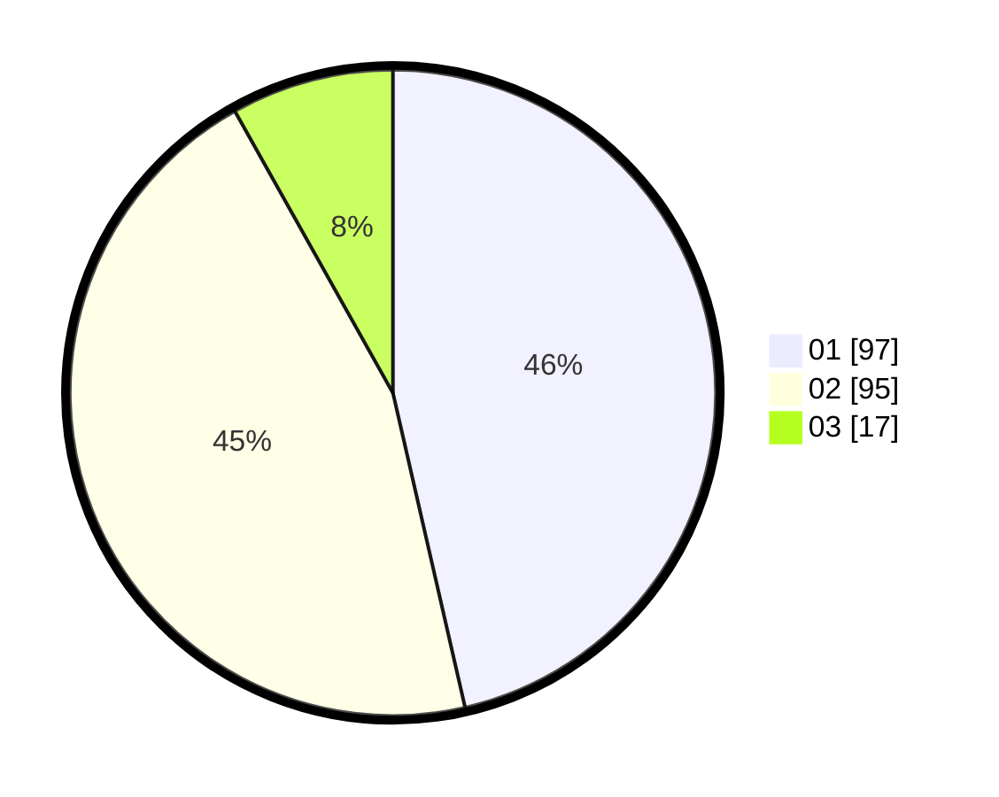

# Hasil

Hasil perolehan suara paslon dapat dilihat pada file paslon-01.txt, paslon-02.txt, dan paslon-03.txt.

Jika tidak ada, artinya data tersebut belum ada pada SIREKAP.

## Perolehan Suara

 * Paslon 01: **97**.
 * Paslon 02: **95**.
 * Paslon 03: **17**.

## Foto C Plano

https://sirekap-obj-formc.kpu.go.id/7f5b/pemilu/ppwp/31/72/05/10/03/3172051003017-20240214-201451--bb1afed0-3481-40ea-a22e-28891130f5a9.jpg

https://sirekap-obj-formc.kpu.go.id/7f5b/pemilu/ppwp/31/72/05/10/03/3172051003017-20240214-195824--9cf86a1c-ac68-42d2-8f7b-3834ce330100.jpg

https://sirekap-obj-formc.kpu.go.id/7f5b/pemilu/ppwp/31/72/05/10/03/3172051003017-20240214-200019--da735901-697e-42e3-af47-71408eaa3e15.jpg

## DATA PEMILIH TETAP

Jumlah pemilih dalam DPT: **283**.
 * L: **141**.
 * P: **142**.

## DATA PENGGUNA HAK PILIH

Jumlah pengguna hak pilih dalam DPT: **194**.
 * L: **98**.
 * P: **96**.

Jumlah pengguna hak pilih dalam DPTb: **10**.
 * L: **8**.
 * P: **2**.

Jumlah pengguna hak pilih dalam DPK: **8**.
 * L: **5**.
 * P: **3**.

Jumlah pengguna hak pilih: **212**.
 * L: **111**.
 * P: **101**.

## JUMLAH SUARA SAH DAN TIDAK SAH

JUMLAH SELURUH SUARA SAH: **9**.

JUMLAH SUARA TIDAK SAH: **7**.

JUMLAH SELURUH SUARA SAH DAN SUARA TIDAK SAH: **212**.
