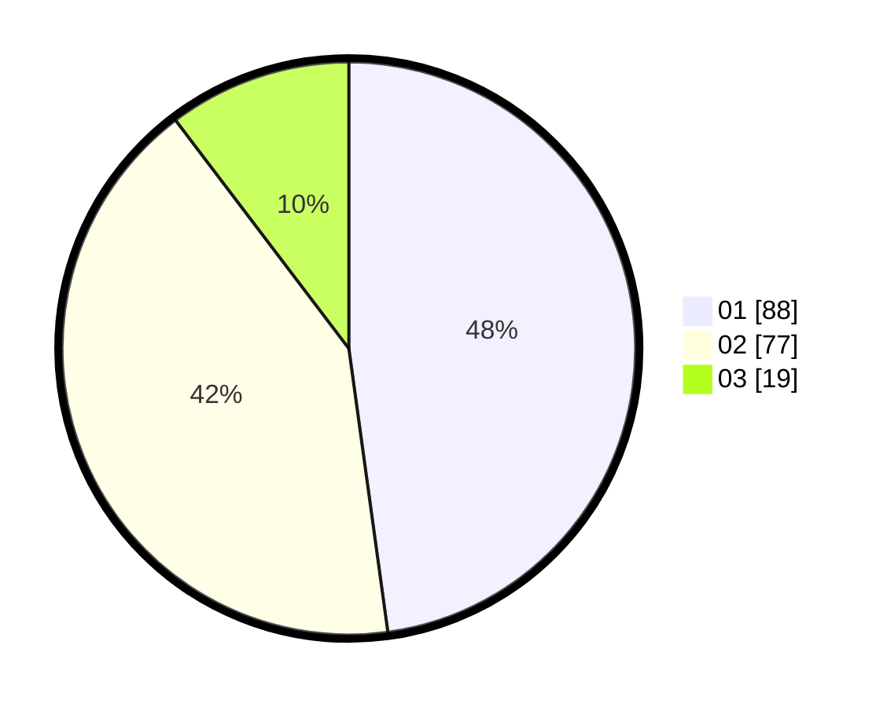

# Hasil

Hasil perolehan suara paslon dapat dilihat pada file paslon-01.txt, paslon-02.txt, dan paslon-03.txt.

Jika tidak ada, artinya data tersebut belum ada pada SIREKAP.

## Perolehan Suara

 * Paslon 01: **88**.
 * Paslon 02: **77**.
 * Paslon 03: **19**.

## Foto C Plano

https://sirekap-obj-formc.kpu.go.id/b62e/pemilu/ppwp/31/72/05/10/03/3172051003031-20240214-200644--7db57913-615c-4ef8-8286-b3507848f263.jpg

https://sirekap-obj-formc.kpu.go.id/b62e/pemilu/ppwp/31/72/05/10/03/3172051003031-20240214-210407--61fab4f3-612b-4911-9f1d-0a5ad0fa13d9.jpg

https://sirekap-obj-formc.kpu.go.id/b62e/pemilu/ppwp/31/72/05/10/03/3172051003031-20240214-200945--2962a03c-9dd1-4733-baf3-fcc61b97e21a.jpg

## DATA PEMILIH TETAP

Jumlah pemilih dalam DPT: **265**.
 * L: **142**.
 * P: **123**.

## DATA PENGGUNA HAK PILIH

Jumlah pengguna hak pilih dalam DPT: **179**.
 * L: **88**.
 * P: **91**.

Jumlah pengguna hak pilih dalam DPTb: **7**.
 * L: **5**.
 * P: **2**.

Jumlah pengguna hak pilih dalam DPK: **0**.
 * L: **0**.
 * P: **0**.

Jumlah pengguna hak pilih: **186**.
 * L: **93**.
 * P: **93**.

## JUMLAH SUARA SAH DAN TIDAK SAH

JUMLAH SELURUH SUARA SAH: **184**.

JUMLAH SUARA TIDAK SAH: **2**.

JUMLAH SELURUH SUARA SAH DAN SUARA TIDAK SAH: **186**.
