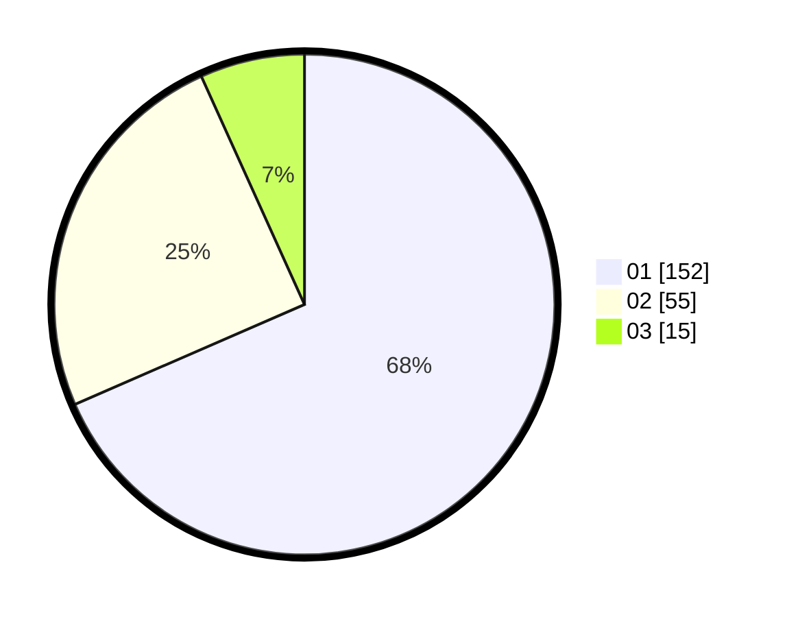

# Hasil

Hasil perolehan suara paslon dapat dilihat pada file paslon-01.txt, paslon-02.txt, dan paslon-03.txt.

Jika tidak ada, artinya data tersebut belum ada pada SIREKAP.

## Perolehan Suara

 * Paslon 01: **152**.
 * Paslon 02: **55**.
 * Paslon 03: **15**.

## Foto C Plano

https://sirekap-obj-formc.kpu.go.id/48ec/pemilu/ppwp/31/72/05/10/03/3172051003063-20240214-225324--a909c542-8dda-4f8f-afd9-83b01f4e6c4f.jpg

https://sirekap-obj-formc.kpu.go.id/48ec/pemilu/ppwp/31/72/05/10/03/3172051003063-20240214-225411--1411a576-118f-4b8f-b2cb-3b4ae8059773.jpg

https://sirekap-obj-formc.kpu.go.id/48ec/pemilu/ppwp/31/72/05/10/03/3172051003063-20240214-224525--6fa43852-fd14-459e-896d-3560476f43bb.jpg

## DATA PEMILIH TETAP

Jumlah pemilih dalam DPT: **266**.
 * L: **131**.
 * P: **135**.

## DATA PENGGUNA HAK PILIH

Jumlah pengguna hak pilih dalam DPT: **218**.
 * L: **106**.
 * P: **112**.

Jumlah pengguna hak pilih dalam DPTb: **4**.
 * L: **2**.
 * P: **2**.

Jumlah pengguna hak pilih dalam DPK: **5**.
 * L: **2**.
 * P: **3**.

Jumlah pengguna hak pilih: **227**.
 * L: **110**.
 * P: **117**.

## JUMLAH SUARA SAH DAN TIDAK SAH

JUMLAH SELURUH SUARA SAH: **222**.

JUMLAH SUARA TIDAK SAH: **5**.

JUMLAH SELURUH SUARA SAH DAN SUARA TIDAK SAH: **227**.
