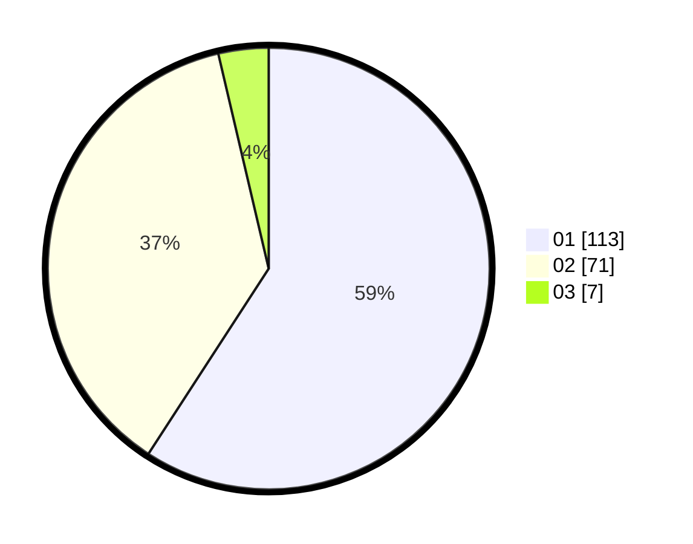

# Hasil

Hasil perolehan suara paslon dapat dilihat pada file paslon-01.txt, paslon-02.txt, dan paslon-03.txt.

Jika tidak ada, artinya data tersebut belum ada pada SIREKAP.

## Perolehan Suara

 * Paslon 01: **113**.
 * Paslon 02: **71**.
 * Paslon 03: **7**.

## Foto C Plano

https://sirekap-obj-formc.kpu.go.id/d646/pemilu/ppwp/31/72/05/10/03/3172051003064-20240216-002631--fd4b35ed-a9c0-4578-9a87-a6facfc23a1c.jpg

https://sirekap-obj-formc.kpu.go.id/d646/pemilu/ppwp/31/72/05/10/03/3172051003064-20240216-002634--435163bd-6e7d-46ff-8306-f938066a1e67.jpg

https://sirekap-obj-formc.kpu.go.id/d646/pemilu/ppwp/31/72/05/10/03/3172051003064-20240216-002632--5264c558-a8dd-424a-91d1-98be042b4937.jpg

## DATA PEMILIH TETAP

Jumlah pemilih dalam DPT: **269**.
 * L: **140**.
 * P: **129**.

## DATA PENGGUNA HAK PILIH

Jumlah pengguna hak pilih dalam DPT: **185**.
 * L: **91**.
 * P: **94**.

Jumlah pengguna hak pilih dalam DPTb: **0**.
 * L: **0**.
 * P: **0**.

Jumlah pengguna hak pilih dalam DPK: **8**.
 * L: **3**.
 * P: **5**.

Jumlah pengguna hak pilih: **193**.
 * L: **94**.
 * P: **99**.

## JUMLAH SUARA SAH DAN TIDAK SAH

JUMLAH SELURUH SUARA SAH: **191**.

JUMLAH SUARA TIDAK SAH: **2**.

JUMLAH SELURUH SUARA SAH DAN SUARA TIDAK SAH: **193**.
