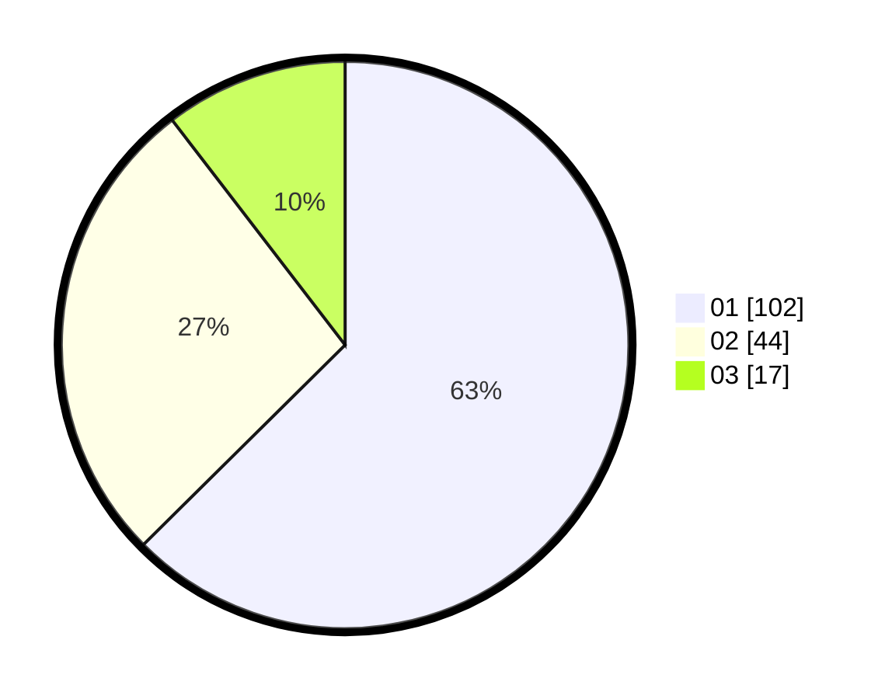

# Hasil

Hasil perolehan suara paslon dapat dilihat pada file paslon-01.txt, paslon-02.txt, dan paslon-03.txt.

Jika tidak ada, artinya data tersebut belum ada pada SIREKAP.

## Perolehan Suara

 * Paslon 01: **102**.
 * Paslon 02: **44**.
 * Paslon 03: **17**.

## Foto C Plano

https://sirekap-obj-formc.kpu.go.id/0f7e/pemilu/ppwp/31/72/05/10/03/3172051003067-20240215-003328--42b83c23-8d8a-44f6-93c1-311ae726cf21.jpg

https://sirekap-obj-formc.kpu.go.id/0f7e/pemilu/ppwp/31/72/05/10/03/3172051003067-20240218-145630--741166ce-7106-4184-9cf5-a7c1095dfd27.jpg

https://sirekap-obj-formc.kpu.go.id/0f7e/pemilu/ppwp/31/72/05/10/03/3172051003067-20240218-163943--65459f7f-c184-4026-a3f5-95246e33b1eb.jpg

## DATA PEMILIH TETAP

Jumlah pemilih dalam DPT: **210**.
 * L: **107**.
 * P: **103**.

## DATA PENGGUNA HAK PILIH

Jumlah pengguna hak pilih dalam DPT: **163**.
 * L: **76**.
 * P: **87**.

Jumlah pengguna hak pilih dalam DPTb: **0**.
 * L: **0**.
 * P: **0**.

Jumlah pengguna hak pilih dalam DPK: **1**.
 * L: **0**.
 * P: **1**.

Jumlah pengguna hak pilih: **164**.
 * L: **76**.
 * P: **88**.

## JUMLAH SUARA SAH DAN TIDAK SAH

JUMLAH SELURUH SUARA SAH: **163**.

JUMLAH SUARA TIDAK SAH: **1**.

JUMLAH SELURUH SUARA SAH DAN SUARA TIDAK SAH: **164**.
