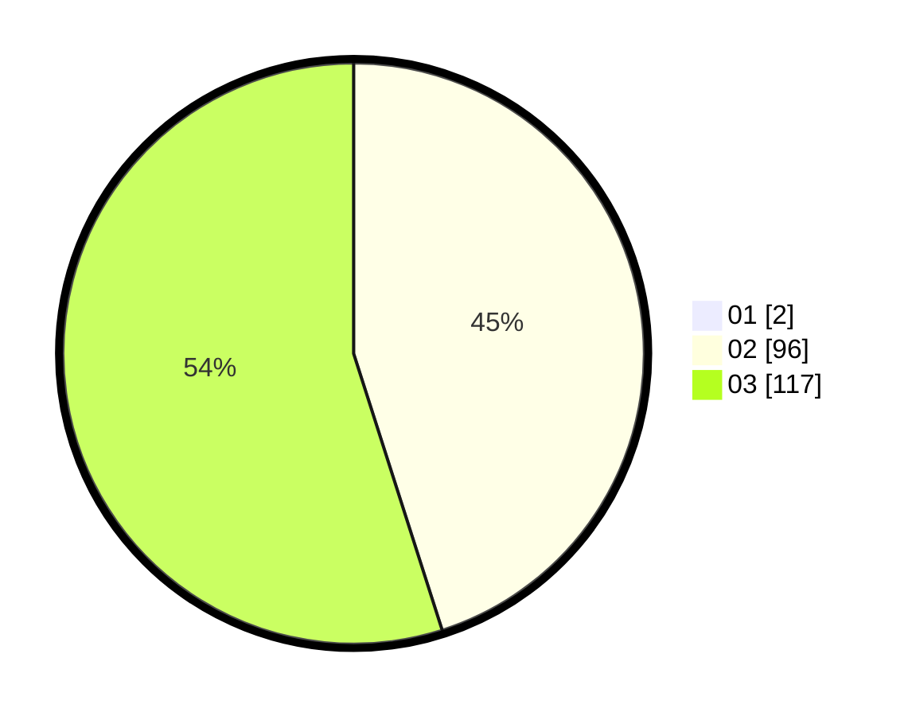

# Hasil

Hasil perolehan suara paslon dapat dilihat pada file paslon-01.txt, paslon-02.txt, dan paslon-03.txt.

Jika tidak ada, artinya data tersebut belum ada pada SIREKAP.

## Perolehan Suara

 * Paslon 01: **2**.
 * Paslon 02: **96**.
 * Paslon 03: **117**.

## Foto C Plano

https://sirekap-obj-formc.kpu.go.id/8bd6/pemilu/ppwp/31/72/06/10/01/3172061001001-20240216-134942--12f244c1-0e13-4a66-95fe-b1b5452bff88.jpg

https://sirekap-obj-formc.kpu.go.id/8bd6/pemilu/ppwp/31/72/06/10/01/3172061001001-20240216-135052--c661e7c7-2341-4a32-824b-374c3400036c.jpg

https://sirekap-obj-formc.kpu.go.id/8bd6/pemilu/ppwp/31/72/06/10/01/3172061001001-20240216-135116--e29d529a-9a16-4a74-9b46-cdadabcdad74.jpg
