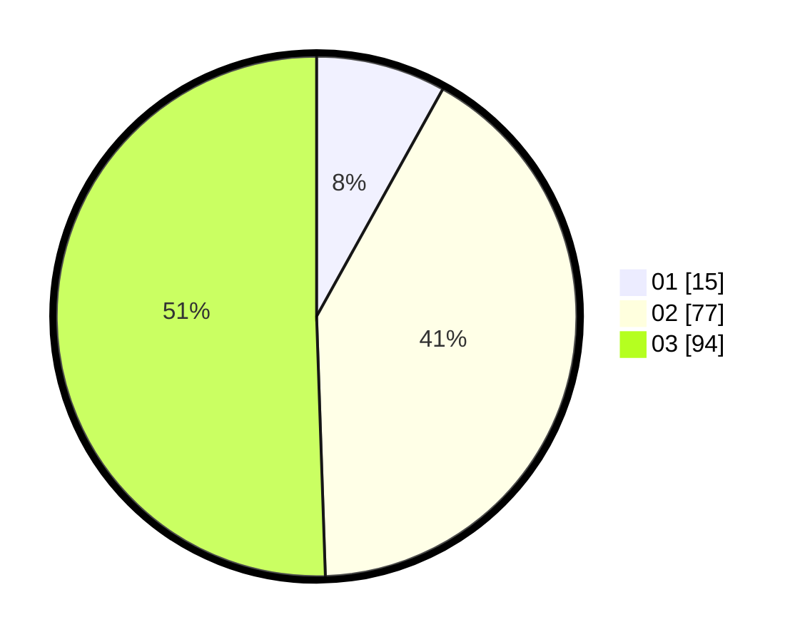

# Hasil

Hasil perolehan suara paslon dapat dilihat pada file paslon-01.txt, paslon-02.txt, dan paslon-03.txt.

Jika tidak ada, artinya data tersebut belum ada pada SIREKAP.

## Perolehan Suara

 * Paslon 01: **15**.
 * Paslon 02: **77**.
 * Paslon 03: **94**.

## Foto C Plano

https://sirekap-obj-formc.kpu.go.id/eeb4/pemilu/ppwp/31/72/06/10/01/3172061001011-20240216-023734--ede63b54-35a5-4609-9d35-65f0f3b37524.jpg

https://sirekap-obj-formc.kpu.go.id/eeb4/pemilu/ppwp/31/72/06/10/01/3172061001011-20240214-155854--530f67c0-376a-4a77-9a23-7ccfbc104d59.jpg

https://sirekap-obj-formc.kpu.go.id/eeb4/pemilu/ppwp/31/72/06/10/01/3172061001011-20240216-023735--99eae3f4-a174-4ab6-aa75-b7a1594e29ce.jpg

## DATA PEMILIH TETAP

Jumlah pemilih dalam DPT: **228**.
 * L: **113**.
 * P: **115**.

## DATA PENGGUNA HAK PILIH

Jumlah pengguna hak pilih dalam DPT: **174**.
 * L: **84**.
 * P: **90**.

Jumlah pengguna hak pilih dalam DPTb: **10**.
 * L: **5**.
 * P: **5**.

Jumlah pengguna hak pilih dalam DPK: **5**.
 * L: **3**.
 * P: **2**.

Jumlah pengguna hak pilih: **189**.
 * L: **92**.
 * P: **97**.

## JUMLAH SUARA SAH DAN TIDAK SAH

JUMLAH SELURUH SUARA SAH: **186**.

JUMLAH SUARA TIDAK SAH: **3**.

JUMLAH SELURUH SUARA SAH DAN SUARA TIDAK SAH: **189**.
