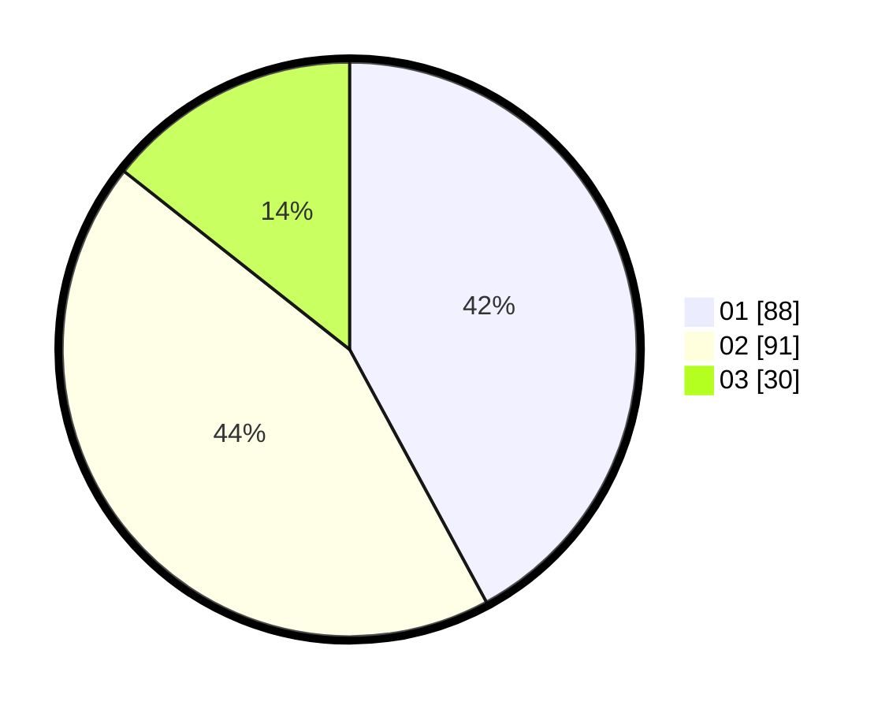

# Hasil

Hasil perolehan suara paslon dapat dilihat pada file paslon-01.txt, paslon-02.txt, dan paslon-03.txt.

Jika tidak ada, artinya data tersebut belum ada pada SIREKAP.

## Perolehan Suara

 * Paslon 01: **88**.
 * Paslon 02: **91**.
 * Paslon 03: **30**.

## Foto C Plano

https://sirekap-obj-formc.kpu.go.id/019b/pemilu/ppwp/31/72/06/10/01/3172061001014-20240214-194343--7939cf0d-4e4d-402f-b0e1-70c675c7b760.jpg

https://sirekap-obj-formc.kpu.go.id/019b/pemilu/ppwp/31/72/06/10/01/3172061001014-20240214-194348--7f46768b-351c-4949-bc37-f5696d99e52d.jpg

https://sirekap-obj-formc.kpu.go.id/019b/pemilu/ppwp/31/72/06/10/01/3172061001014-20240214-194353--347771ea-d4bb-4d50-8473-d3cdd21e8d0d.jpg

## DATA PEMILIH TETAP

Jumlah pemilih dalam DPT: **243**.
 * L: **129**.
 * P: **114**.

## DATA PENGGUNA HAK PILIH

Jumlah pengguna hak pilih dalam DPT: **206**.
 * L: **105**.
 * P: **101**.

Jumlah pengguna hak pilih dalam DPTb: **4**.
 * L: **1**.
 * P: **3**.

Jumlah pengguna hak pilih dalam DPK: **0**.
 * L: **0**.
 * P: **0**.

Jumlah pengguna hak pilih: **210**.
 * L: **106**.
 * P: **104**.

## JUMLAH SUARA SAH DAN TIDAK SAH

JUMLAH SELURUH SUARA SAH: **209**.

JUMLAH SUARA TIDAK SAH: **1**.

JUMLAH SELURUH SUARA SAH DAN SUARA TIDAK SAH: **210**.
