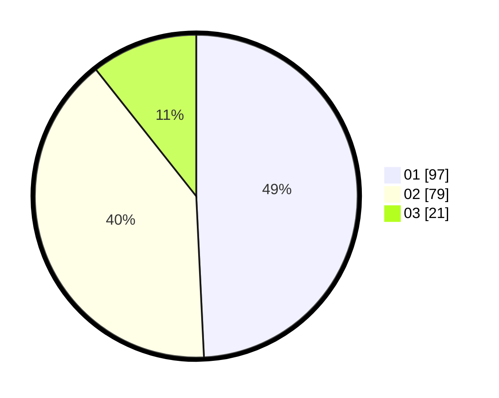

# Hasil

Hasil perolehan suara paslon dapat dilihat pada file paslon-01.txt, paslon-02.txt, dan paslon-03.txt.

Jika tidak ada, artinya data tersebut belum ada pada SIREKAP.

## Perolehan Suara

 * Paslon 01: **97**.
 * Paslon 02: **79**.
 * Paslon 03: **21**.

## Foto C Plano

https://sirekap-obj-formc.kpu.go.id/9a0d/pemilu/ppwp/31/72/06/10/01/3172061001026-20240218-144607--95b97e21-41fa-4a09-8993-7434dc0ea4e1.jpg

https://sirekap-obj-formc.kpu.go.id/9a0d/pemilu/ppwp/31/72/06/10/01/3172061001026-20240218-150014--c21476f9-9ade-43ab-923c-d44a03512660.jpg

https://sirekap-obj-formc.kpu.go.id/9a0d/pemilu/ppwp/31/72/06/10/01/3172061001026-20240218-144810--23080317-4fb1-4fb4-aa25-528e94ac31d6.jpg

## DATA PEMILIH TETAP

Jumlah pemilih dalam DPT: **267**.
 * L: **133**.
 * P: **134**.

## DATA PENGGUNA HAK PILIH

Jumlah pengguna hak pilih dalam DPT: **199**.
 * L: **96**.
 * P: **103**.

Jumlah pengguna hak pilih dalam DPTb: **0**.
 * L: **0**.
 * P: **0**.

Jumlah pengguna hak pilih dalam DPK: **0**.
 * L: **0**.
 * P: **0**.

Jumlah pengguna hak pilih: **199**.
 * L: **96**.
 * P: **103**.

## JUMLAH SUARA SAH DAN TIDAK SAH

JUMLAH SELURUH SUARA SAH: **197**.

JUMLAH SUARA TIDAK SAH: **2**.

JUMLAH SELURUH SUARA SAH DAN SUARA TIDAK SAH: **199**.
