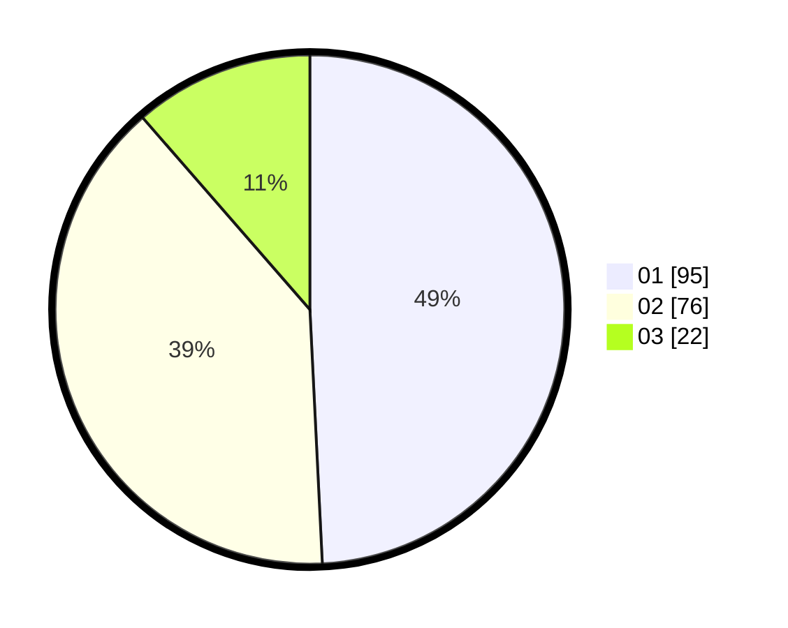

# Hasil

Hasil perolehan suara paslon dapat dilihat pada file paslon-01.txt, paslon-02.txt, dan paslon-03.txt.

Jika tidak ada, artinya data tersebut belum ada pada SIREKAP.

## Perolehan Suara

 * Paslon 01: **95**.
 * Paslon 02: **76**.
 * Paslon 03: **22**.

## Foto C Plano

https://sirekap-obj-formc.kpu.go.id/231a/pemilu/ppwp/31/72/06/10/01/3172061001027-20240216-135115--0e87ac0c-918b-4dfa-bad1-389865302169.jpg

https://sirekap-obj-formc.kpu.go.id/231a/pemilu/ppwp/31/72/06/10/01/3172061001027-20240216-135116--dbe1cabe-800d-4578-8a79-008117deaa27.jpg

https://sirekap-obj-formc.kpu.go.id/231a/pemilu/ppwp/31/72/06/10/01/3172061001027-20240216-135115--50b0b2b2-265d-4f67-ad9c-0025344cbf01.jpg

## DATA PEMILIH TETAP

Jumlah pemilih dalam DPT: **0**.
 * L: **0**.
 * P: **0**.

## DATA PENGGUNA HAK PILIH

Jumlah pengguna hak pilih dalam DPT: **0**.
 * L: **0**.
 * P: **0**.

Jumlah pengguna hak pilih dalam DPTb: **0**.
 * L: **0**.
 * P: **0**.

Jumlah pengguna hak pilih dalam DPK: **0**.
 * L: **0**.
 * P: **0**.

Jumlah pengguna hak pilih: **0**.
 * L: **0**.
 * P: **0**.

## JUMLAH SUARA SAH DAN TIDAK SAH

JUMLAH SELURUH SUARA SAH: **193**.

JUMLAH SUARA TIDAK SAH: **3**.

JUMLAH SELURUH SUARA SAH DAN SUARA TIDAK SAH: **196**.
