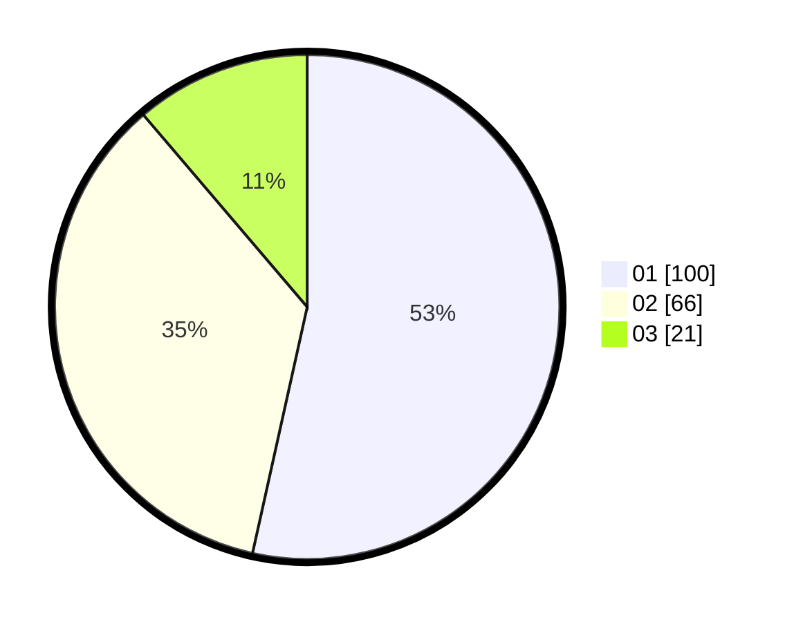

# Hasil

Hasil perolehan suara paslon dapat dilihat pada file paslon-01.txt, paslon-02.txt, dan paslon-03.txt.

Jika tidak ada, artinya data tersebut belum ada pada SIREKAP.

## Perolehan Suara

 * Paslon 01: **100**.
 * Paslon 02: **66**.
 * Paslon 03: **21**.

## Foto C Plano

https://sirekap-obj-formc.kpu.go.id/5245/pemilu/ppwp/31/72/06/10/01/3172061001029-20240214-212811--2884b25c-6a92-45b9-99d9-17b4da7b808c.jpg

https://sirekap-obj-formc.kpu.go.id/5245/pemilu/ppwp/31/72/06/10/01/3172061001029-20240214-214358--a2482c91-e249-41d0-a111-baec9dc20416.jpg

https://sirekap-obj-formc.kpu.go.id/5245/pemilu/ppwp/31/72/06/10/01/3172061001029-20240214-202020--937561d3-7998-40a7-88da-575b3d618512.jpg
