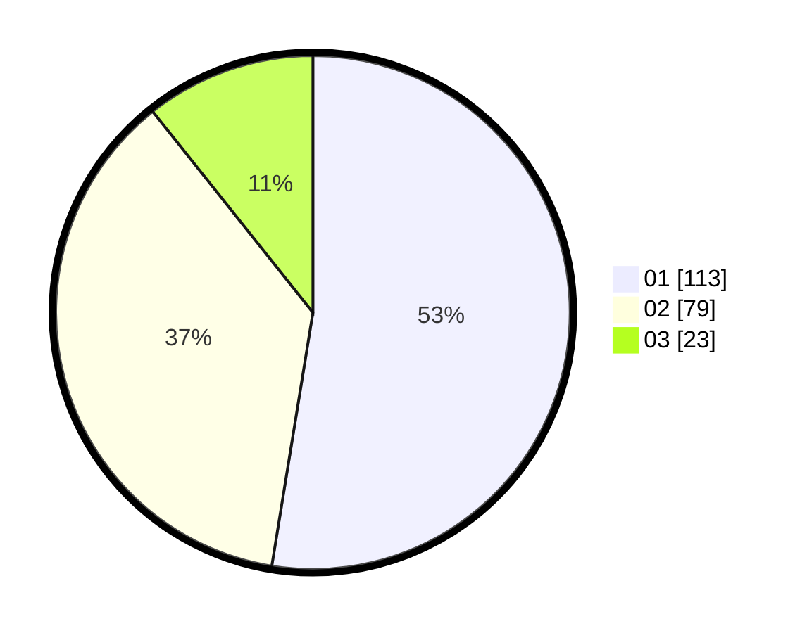

# Hasil

Hasil perolehan suara paslon dapat dilihat pada file paslon-01.txt, paslon-02.txt, dan paslon-03.txt.

Jika tidak ada, artinya data tersebut belum ada pada SIREKAP.

## Perolehan Suara

 * Paslon 01: **113**.
 * Paslon 02: **79**.
 * Paslon 03: **23**.

## Foto C Plano

https://sirekap-obj-formc.kpu.go.id/2172/pemilu/ppwp/31/72/06/10/01/3172061001037-20240215-025959--4bb93b45-b134-43b3-8876-2584bcb8c878.jpg

https://sirekap-obj-formc.kpu.go.id/2172/pemilu/ppwp/31/72/06/10/01/3172061001037-20240215-030105--bc01a344-ba92-41d3-bcf8-5b812ba63b83.jpg

https://sirekap-obj-formc.kpu.go.id/2172/pemilu/ppwp/31/72/06/10/01/3172061001037-20240215-030209--2e504f0a-0938-4c91-b05f-a22192471ce7.jpg

## DATA PEMILIH TETAP

Jumlah pemilih dalam DPT: **288**.
 * L: **147**.
 * P: **141**.

## DATA PENGGUNA HAK PILIH

Jumlah pengguna hak pilih dalam DPT: **215**.
 * L: **106**.
 * P: **109**.

Jumlah pengguna hak pilih dalam DPTb: **5**.
 * L: **3**.
 * P: **2**.

Jumlah pengguna hak pilih dalam DPK: **0**.
 * L: **0**.
 * P: **0**.

Jumlah pengguna hak pilih: **220**.
 * L: **109**.
 * P: **111**.

## JUMLAH SUARA SAH DAN TIDAK SAH

JUMLAH SELURUH SUARA SAH: **215**.

JUMLAH SUARA TIDAK SAH: **5**.

JUMLAH SELURUH SUARA SAH DAN SUARA TIDAK SAH: **220**.
