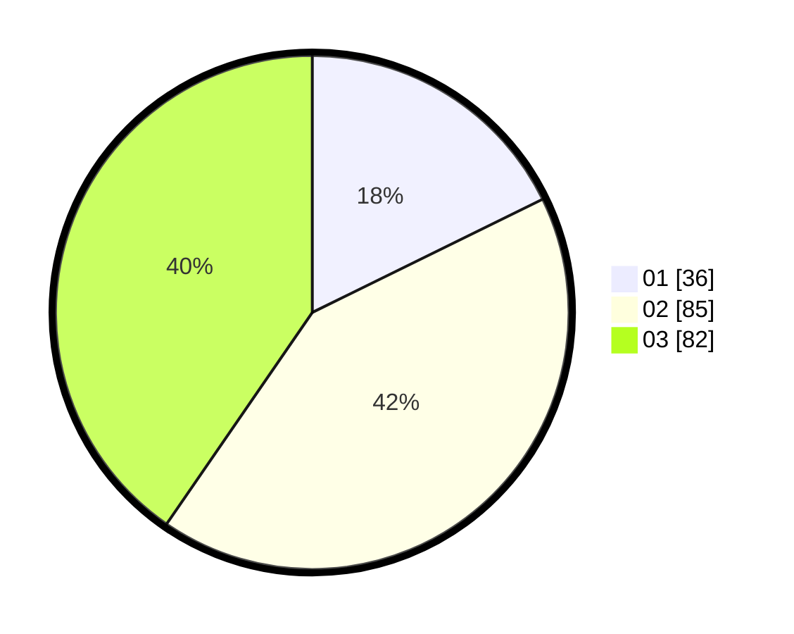

# Hasil

Hasil perolehan suara paslon dapat dilihat pada file paslon-01.txt, paslon-02.txt, dan paslon-03.txt.

Jika tidak ada, artinya data tersebut belum ada pada SIREKAP.

## Perolehan Suara

 * Paslon 01: **36**.
 * Paslon 02: **85**.
 * Paslon 03: **82**.

## Foto C Plano

https://sirekap-obj-formc.kpu.go.id/8655/pemilu/ppwp/31/72/06/10/01/3172061001042-20240214-194345--e743480c-937b-4e9b-b85f-4578e20bef04.jpg

https://sirekap-obj-formc.kpu.go.id/8655/pemilu/ppwp/31/72/06/10/01/3172061001042-20240214-201813--ffd271bf-0186-4b21-9913-741f3fd0e37b.jpg

https://sirekap-obj-formc.kpu.go.id/8655/pemilu/ppwp/31/72/06/10/01/3172061001042-20240214-194655--2b6eabe9-fa0d-46b7-9b08-ff361b39bd73.jpg

## DATA PEMILIH TETAP

Jumlah pemilih dalam DPT: **274**.
 * L: **127**.
 * P: **147**.

## DATA PENGGUNA HAK PILIH

Jumlah pengguna hak pilih dalam DPT: **202**.
 * L: **93**.
 * P: **109**.

Jumlah pengguna hak pilih dalam DPTb: **5**.
 * L: **3**.
 * P: **2**.

Jumlah pengguna hak pilih dalam DPK: **0**.
 * L: **0**.
 * P: **0**.

Jumlah pengguna hak pilih: **207**.
 * L: **96**.
 * P: **111**.

## JUMLAH SUARA SAH DAN TIDAK SAH

JUMLAH SELURUH SUARA SAH: **203**.

JUMLAH SUARA TIDAK SAH: **4**.

JUMLAH SELURUH SUARA SAH DAN SUARA TIDAK SAH: **207**.
