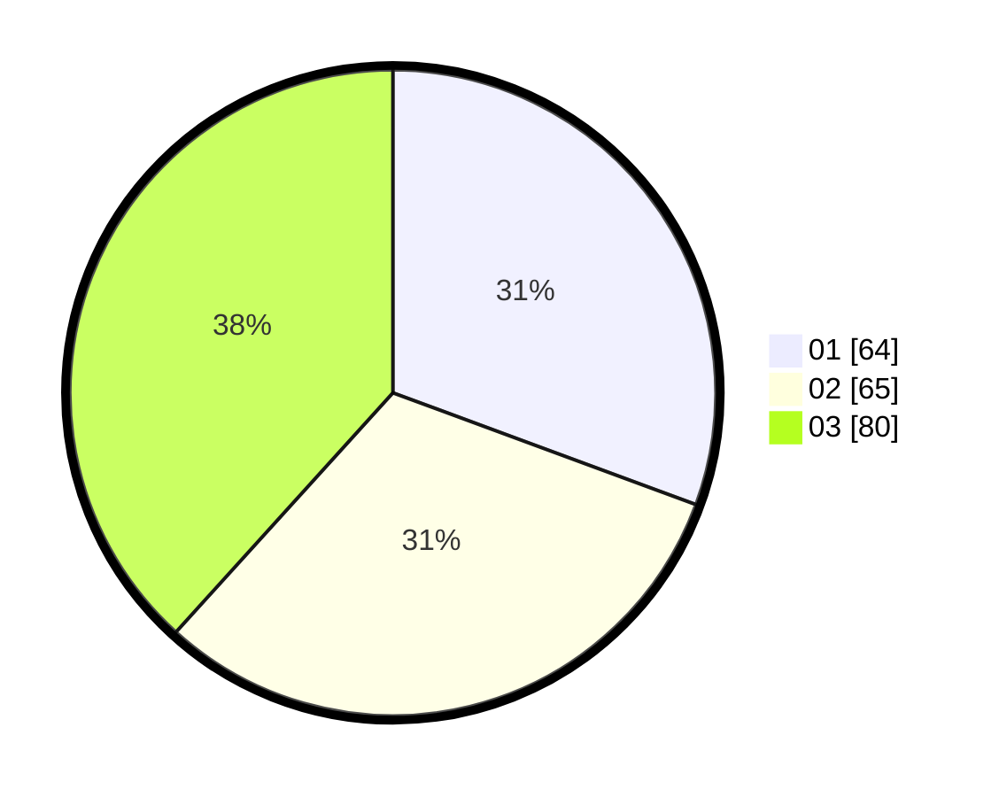

# Hasil

Hasil perolehan suara paslon dapat dilihat pada file paslon-01.txt, paslon-02.txt, dan paslon-03.txt.

Jika tidak ada, artinya data tersebut belum ada pada SIREKAP.

## Perolehan Suara

 * Paslon 01: **64**.
 * Paslon 02: **65**.
 * Paslon 03: **80**.

## Foto C Plano

https://sirekap-obj-formc.kpu.go.id/52b5/pemilu/ppwp/31/72/06/10/01/3172061001051-20240214-155220--df231bd8-c498-4634-8688-d31dcab7ff28.jpg

https://sirekap-obj-formc.kpu.go.id/52b5/pemilu/ppwp/31/72/06/10/01/3172061001051-20240214-155835--6ea4f976-5647-41ef-895f-0fc24870397b.jpg

https://sirekap-obj-formc.kpu.go.id/52b5/pemilu/ppwp/31/72/06/10/01/3172061001051-20240214-155321--86ae10de-d7af-4099-ab69-d7e600fca964.jpg

## DATA PEMILIH TETAP

Jumlah pemilih dalam DPT: **278**.
 * L: **122**.
 * P: **156**.

## DATA PENGGUNA HAK PILIH

Jumlah pengguna hak pilih dalam DPT: **213**.
 * L: **93**.
 * P: **120**.

Jumlah pengguna hak pilih dalam DPTb: **4**.
 * L: **1**.
 * P: **3**.

Jumlah pengguna hak pilih dalam DPK: **0**.
 * L: **0**.
 * P: **0**.

Jumlah pengguna hak pilih: **217**.
 * L: **94**.
 * P: **123**.

## JUMLAH SUARA SAH DAN TIDAK SAH

JUMLAH SELURUH SUARA SAH: **209**.

JUMLAH SUARA TIDAK SAH: **8**.

JUMLAH SELURUH SUARA SAH DAN SUARA TIDAK SAH: **217**.
