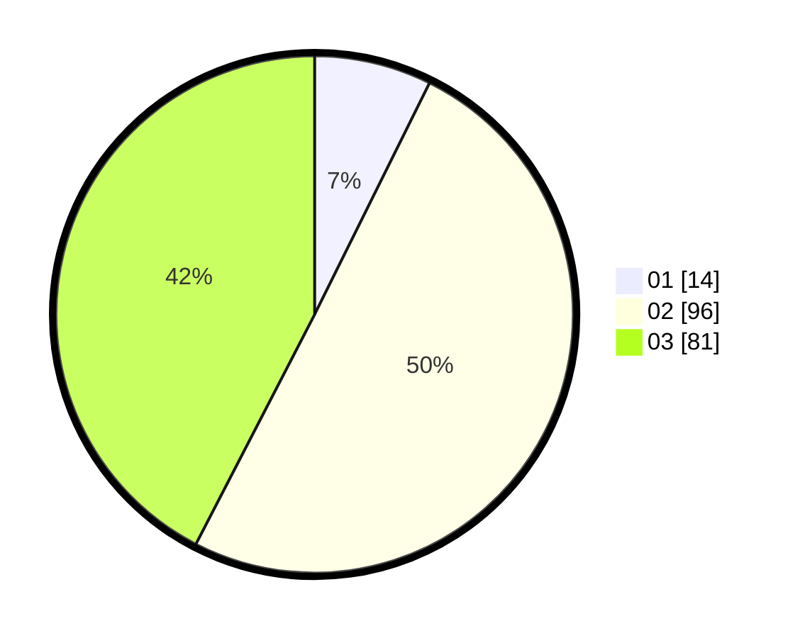

# Hasil

Hasil perolehan suara paslon dapat dilihat pada file paslon-01.txt, paslon-02.txt, dan paslon-03.txt.

Jika tidak ada, artinya data tersebut belum ada pada SIREKAP.

## Perolehan Suara

 * Paslon 01: **14**.
 * Paslon 02: **96**.
 * Paslon 03: **81**.

## Foto C Plano

https://sirekap-obj-formc.kpu.go.id/8871/pemilu/ppwp/31/72/06/10/01/3172061001060-20240214-211938--98a163ac-4fe9-4409-ac6e-1cb9139356da.jpg

https://sirekap-obj-formc.kpu.go.id/8871/pemilu/ppwp/31/72/06/10/01/3172061001060-20240214-211854--14ccac3f-9ab5-4524-896a-4e2ccbda9b78.jpg

https://sirekap-obj-formc.kpu.go.id/8871/pemilu/ppwp/31/72/06/10/01/3172061001060-20240214-211801--5cd5b88d-61a0-4df1-9780-8c67993e53dc.jpg

## DATA PEMILIH TETAP

Jumlah pemilih dalam DPT: **264**.
 * L: **117**.
 * P: **147**.

## DATA PENGGUNA HAK PILIH

Jumlah pengguna hak pilih dalam DPT: **185**.
 * L: **89**.
 * P: **96**.

Jumlah pengguna hak pilih dalam DPTb: **7**.
 * L: **4**.
 * P: **3**.

Jumlah pengguna hak pilih dalam DPK: **1**.
 * L: **1**.
 * P: **0**.

Jumlah pengguna hak pilih: **193**.
 * L: **94**.
 * P: **99**.

## JUMLAH SUARA SAH DAN TIDAK SAH

JUMLAH SELURUH SUARA SAH: **191**.

JUMLAH SUARA TIDAK SAH: **2**.

JUMLAH SELURUH SUARA SAH DAN SUARA TIDAK SAH: **193**.
