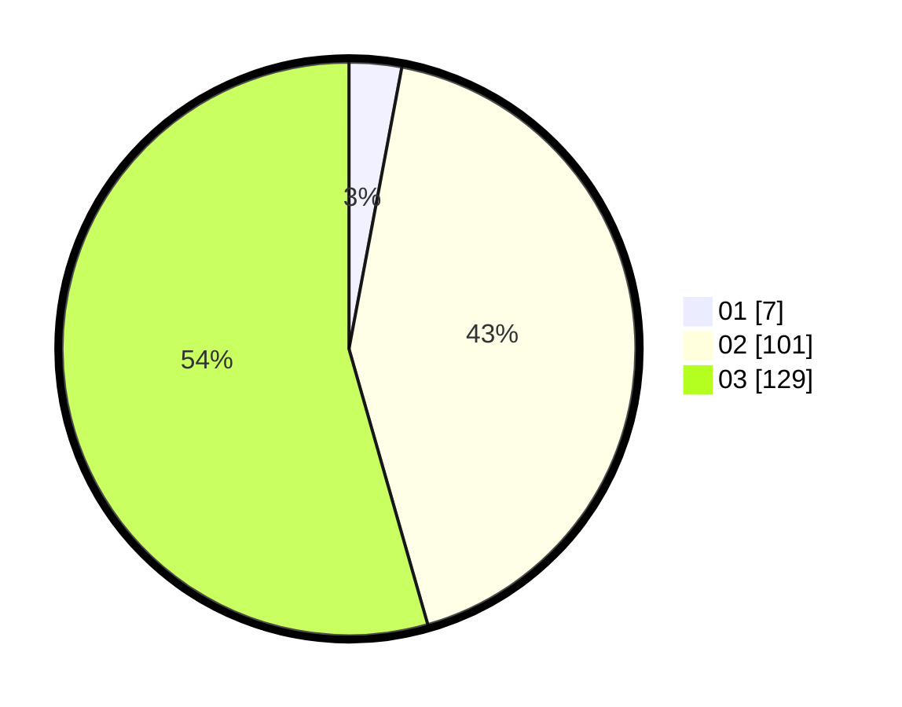

# Hasil

Hasil perolehan suara paslon dapat dilihat pada file paslon-01.txt, paslon-02.txt, dan paslon-03.txt.

Jika tidak ada, artinya data tersebut belum ada pada SIREKAP.

## Perolehan Suara

 * Paslon 01: **7**.
 * Paslon 02: **101**.
 * Paslon 03: **129**.

## Foto C Plano

https://sirekap-obj-formc.kpu.go.id/0c99/pemilu/ppwp/31/72/06/10/01/3172061001072-20240214-185336--76448c36-cd41-4e28-a4e6-509f8be537f8.jpg

https://sirekap-obj-formc.kpu.go.id/0c99/pemilu/ppwp/31/72/06/10/01/3172061001072-20240214-185338--84c8c136-7090-47dc-b796-f915ff198a92.jpg

https://sirekap-obj-formc.kpu.go.id/0c99/pemilu/ppwp/31/72/06/10/01/3172061001072-20240214-185341--fd6a01d0-bd37-422c-ab5d-efa9bb4041bb.jpg

## DATA PEMILIH TETAP

Jumlah pemilih dalam DPT: **275**.
 * L: **432**.
 * P: **138**.

## DATA PENGGUNA HAK PILIH

Jumlah pengguna hak pilih dalam DPT: **222**.
 * L: **110**.
 * P: **112**.

Jumlah pengguna hak pilih dalam DPTb: **14**.
 * L: **5**.
 * P: **9**.

Jumlah pengguna hak pilih dalam DPK: **3**.
 * L: **1**.
 * P: **2**.

Jumlah pengguna hak pilih: **239**.
 * L: **116**.
 * P: **123**.

## JUMLAH SUARA SAH DAN TIDAK SAH

JUMLAH SELURUH SUARA SAH: **237**.

JUMLAH SUARA TIDAK SAH: **2**.

JUMLAH SELURUH SUARA SAH DAN SUARA TIDAK SAH: **239**.
