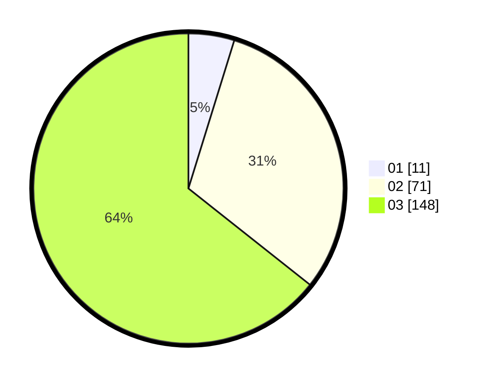

# Hasil

Hasil perolehan suara paslon dapat dilihat pada file paslon-01.txt, paslon-02.txt, dan paslon-03.txt.

Jika tidak ada, artinya data tersebut belum ada pada SIREKAP.

## Perolehan Suara

 * Paslon 01: **11**.
 * Paslon 02: **71**.
 * Paslon 03: **148**.

## Foto C Plano

https://sirekap-obj-formc.kpu.go.id/85a6/pemilu/ppwp/31/72/06/10/01/3172061001074-20240214-191658--85756dad-8904-4080-8297-e9e26908800d.jpg

https://sirekap-obj-formc.kpu.go.id/85a6/pemilu/ppwp/31/72/06/10/01/3172061001074-20240214-191705--ed142fe8-ede5-43a9-925a-13f7b051a270.jpg

https://sirekap-obj-formc.kpu.go.id/85a6/pemilu/ppwp/31/72/06/10/01/3172061001074-20240214-191713--df8bce4c-61ea-4a48-9215-d3f777761f36.jpg

## DATA PEMILIH TETAP

Jumlah pemilih dalam DPT: **274**.
 * L: **119**.
 * P: **155**.

## DATA PENGGUNA HAK PILIH

Jumlah pengguna hak pilih dalam DPT: **225**.
 * L: **98**.
 * P: **127**.

Jumlah pengguna hak pilih dalam DPTb: **13**.
 * L: **8**.
 * P: **5**.

Jumlah pengguna hak pilih dalam DPK: **0**.
 * L: **0**.
 * P: **0**.

Jumlah pengguna hak pilih: **238**.
 * L: **106**.
 * P: **132**.

## JUMLAH SUARA SAH DAN TIDAK SAH

JUMLAH SELURUH SUARA SAH: **230**.

JUMLAH SUARA TIDAK SAH: **8**.

JUMLAH SELURUH SUARA SAH DAN SUARA TIDAK SAH: **238**.
