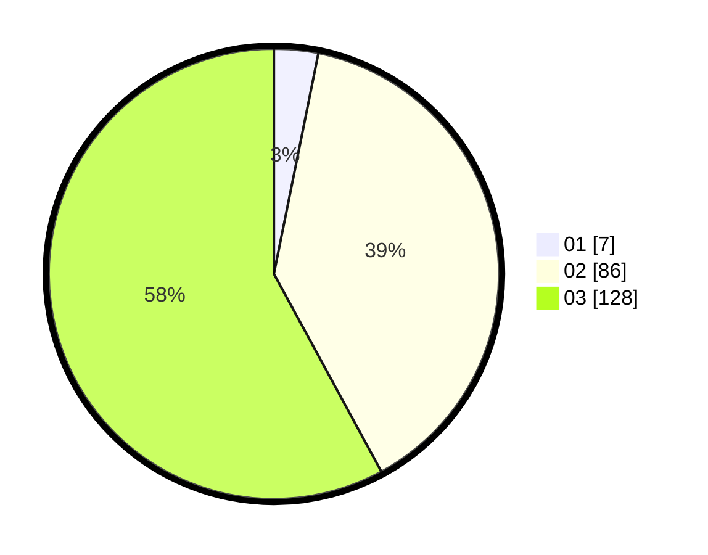

# Hasil

Hasil perolehan suara paslon dapat dilihat pada file paslon-01.txt, paslon-02.txt, dan paslon-03.txt.

Jika tidak ada, artinya data tersebut belum ada pada SIREKAP.

## Perolehan Suara

 * Paslon 01: **7**.
 * Paslon 02: **86**.
 * Paslon 03: **128**.

## Foto C Plano

https://sirekap-obj-formc.kpu.go.id/d199/pemilu/ppwp/31/72/06/10/01/3172061001075-20240214-193459--dc267d3a-5b96-4f80-b080-0201897b72a9.jpg

https://sirekap-obj-formc.kpu.go.id/d199/pemilu/ppwp/31/72/06/10/01/3172061001075-20240214-190516--607ebe14-e1f5-478d-8212-ec2cb5f35778.jpg

https://sirekap-obj-formc.kpu.go.id/d199/pemilu/ppwp/31/72/06/10/01/3172061001075-20240214-193915--2484eff3-305f-4d57-bc08-608ab137c950.jpg

## DATA PEMILIH TETAP

Jumlah pemilih dalam DPT: **273**.
 * L: **121**.
 * P: **152**.

## DATA PENGGUNA HAK PILIH

Jumlah pengguna hak pilih dalam DPT: **204**.
 * L: **93**.
 * P: **111**.

Jumlah pengguna hak pilih dalam DPTb: **12**.
 * L: **6**.
 * P: **6**.

Jumlah pengguna hak pilih dalam DPK: **6**.
 * L: **1**.
 * P: **5**.

Jumlah pengguna hak pilih: **222**.
 * L: **100**.
 * P: **122**.

## JUMLAH SUARA SAH DAN TIDAK SAH

JUMLAH SELURUH SUARA SAH: **221**.

JUMLAH SUARA TIDAK SAH: **1**.

JUMLAH SELURUH SUARA SAH DAN SUARA TIDAK SAH: **222**.
