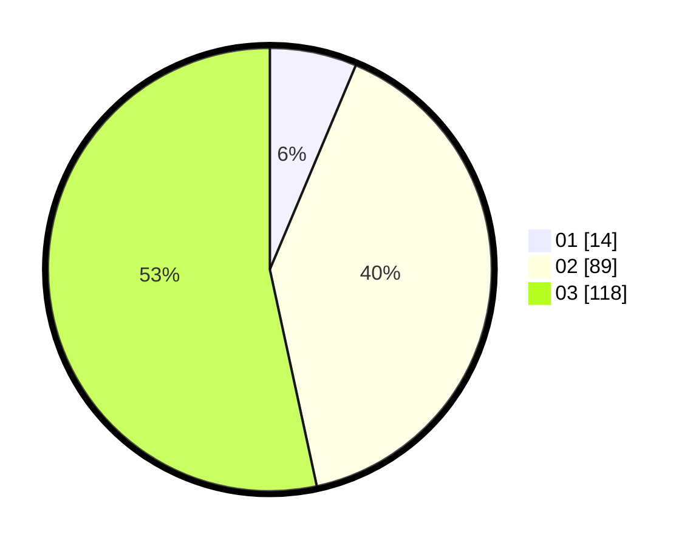

# Hasil

Hasil perolehan suara paslon dapat dilihat pada file paslon-01.txt, paslon-02.txt, dan paslon-03.txt.

Jika tidak ada, artinya data tersebut belum ada pada SIREKAP.

## Perolehan Suara

 * Paslon 01: **14**.
 * Paslon 02: **89**.
 * Paslon 03: **118**.

## Foto C Plano

https://sirekap-obj-formc.kpu.go.id/37c2/pemilu/ppwp/31/72/06/10/01/3172061001077-20240214-213747--c0426862-f528-4eae-89bf-7d6d30ebf2d0.jpg

https://sirekap-obj-formc.kpu.go.id/37c2/pemilu/ppwp/31/72/06/10/01/3172061001077-20240214-213839--26ce3b08-c174-4d4f-a93e-768a4ef03020.jpg

https://sirekap-obj-formc.kpu.go.id/37c2/pemilu/ppwp/31/72/06/10/01/3172061001077-20240214-213945--78f36d95-72aa-42c3-a419-40d3409803c7.jpg

## DATA PEMILIH TETAP

Jumlah pemilih dalam DPT: **273**.
 * L: **126**.
 * P: **147**.

## DATA PENGGUNA HAK PILIH

Jumlah pengguna hak pilih dalam DPT: **214**.
 * L: **96**.
 * P: **118**.

Jumlah pengguna hak pilih dalam DPTb: **12**.
 * L: **8**.
 * P: **4**.

Jumlah pengguna hak pilih dalam DPK: **1**.
 * L: **1**.
 * P: **0**.

Jumlah pengguna hak pilih: **227**.
 * L: **105**.
 * P: **122**.

## JUMLAH SUARA SAH DAN TIDAK SAH

JUMLAH SELURUH SUARA SAH: **221**.

JUMLAH SUARA TIDAK SAH: **6**.

JUMLAH SELURUH SUARA SAH DAN SUARA TIDAK SAH: **227**.
