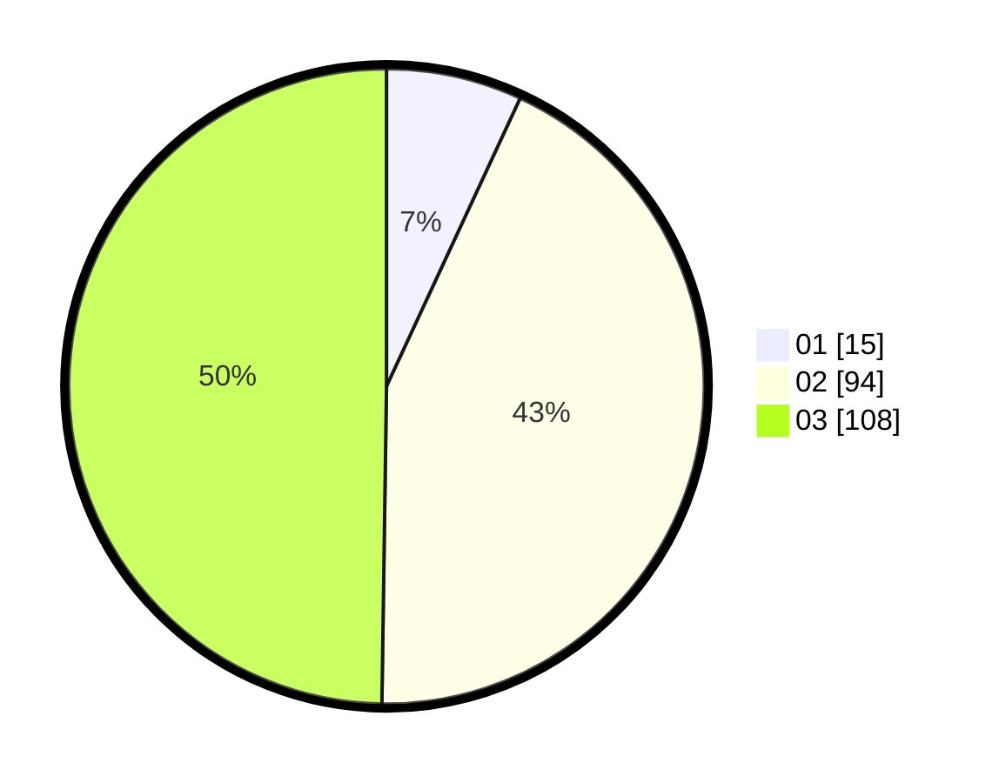

# Hasil

Hasil perolehan suara paslon dapat dilihat pada file paslon-01.txt, paslon-02.txt, dan paslon-03.txt.

Jika tidak ada, artinya data tersebut belum ada pada SIREKAP.

## Perolehan Suara

 * Paslon 01: **15**.
 * Paslon 02: **94**.
 * Paslon 03: **108**.

## Foto C Plano

https://sirekap-obj-formc.kpu.go.id/56c2/pemilu/ppwp/31/72/06/10/01/3172061001110-20240214-192024--68c3488c-4efb-4338-bc69-2fd77feb46aa.jpg

https://sirekap-obj-formc.kpu.go.id/56c2/pemilu/ppwp/31/72/06/10/01/3172061001110-20240214-192132--2e944fc5-3ead-4b70-aea4-5da8dec82ca8.jpg

https://sirekap-obj-formc.kpu.go.id/56c2/pemilu/ppwp/31/72/06/10/01/3172061001110-20240214-192228--31c79df0-b781-4ed7-81e8-16f441d8bb73.jpg
