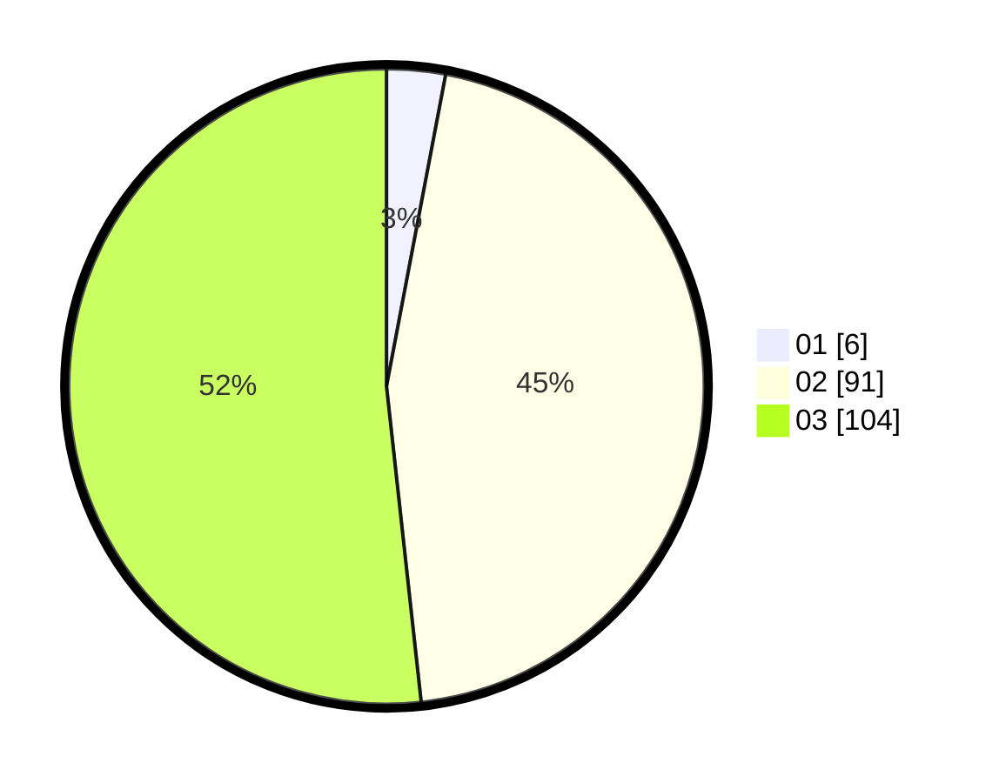

# Hasil

Hasil perolehan suara paslon dapat dilihat pada file paslon-01.txt, paslon-02.txt, dan paslon-03.txt.

Jika tidak ada, artinya data tersebut belum ada pada SIREKAP.

## Perolehan Suara

 * Paslon 01: **6**.
 * Paslon 02: **91**.
 * Paslon 03: **104**.

## Foto C Plano

https://sirekap-obj-formc.kpu.go.id/ae6a/pemilu/ppwp/31/72/06/10/01/3172061001111-20240215-233134--ee56926d-5123-4c3c-8054-64f66f191ac0.jpg

https://sirekap-obj-formc.kpu.go.id/ae6a/pemilu/ppwp/31/72/06/10/01/3172061001111-20240215-233413--c81b0f41-2e6a-4a72-a4e9-0a86b8fb515d.jpg
