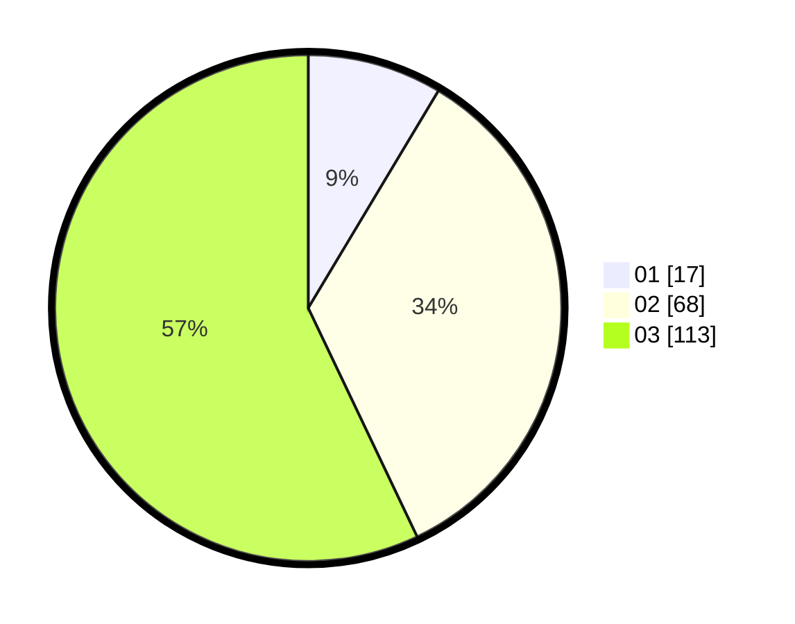

# Hasil

Hasil perolehan suara paslon dapat dilihat pada file paslon-01.txt, paslon-02.txt, dan paslon-03.txt.

Jika tidak ada, artinya data tersebut belum ada pada SIREKAP.

## Perolehan Suara

 * Paslon 01: **17**.
 * Paslon 02: **68**.
 * Paslon 03: **113**.

## Foto C Plano

https://sirekap-obj-formc.kpu.go.id/2c47/pemilu/ppwp/31/72/06/10/01/3172061001112-20240214-190557--55f88c7f-96c4-4651-a8e3-bfae6a73acd8.jpg

https://sirekap-obj-formc.kpu.go.id/2c47/pemilu/ppwp/31/72/06/10/01/3172061001112-20240214-190622--cd35a022-a595-4068-aa4b-5a56151a9a66.jpg

https://sirekap-obj-formc.kpu.go.id/2c47/pemilu/ppwp/31/72/06/10/01/3172061001112-20240214-191127--7a3731dd-a501-4935-afd5-c05589201eaf.jpg
