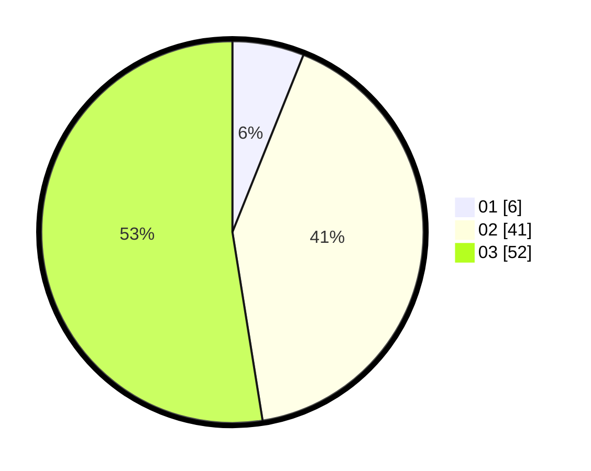

# Hasil

Hasil perolehan suara paslon dapat dilihat pada file paslon-01.txt, paslon-02.txt, dan paslon-03.txt.

Jika tidak ada, artinya data tersebut belum ada pada SIREKAP.

## Perolehan Suara

 * Paslon 01: **6**.
 * Paslon 02: **41**.
 * Paslon 03: **52**.

## Foto C Plano

https://sirekap-obj-formc.kpu.go.id/03be/pemilu/ppwp/31/72/06/10/01/3172061001119-20240215-234407--17fc9a97-78f8-4892-a281-6b75d6bbbf59.jpg

https://sirekap-obj-formc.kpu.go.id/03be/pemilu/ppwp/31/72/06/10/01/3172061001119-20240215-234413--4fd01a8a-44ca-4457-acad-32f50e1fc2e7.jpg

https://sirekap-obj-formc.kpu.go.id/03be/pemilu/ppwp/31/72/06/10/01/3172061001119-20240215-234417--f371721a-f0f9-4d04-8e8a-44a8b95bbdaa.jpg

## DATA PEMILIH TETAP

Jumlah pemilih dalam DPT: **131**.
 * L: **60**.
 * P: **71**.

## DATA PENGGUNA HAK PILIH

Jumlah pengguna hak pilih dalam DPT: **92**.
 * L: **42**.
 * P: **50**.

Jumlah pengguna hak pilih dalam DPTb: **7**.
 * L: **3**.
 * P: **4**.

Jumlah pengguna hak pilih dalam DPK: **2**.
 * L: **1**.
 * P: **1**.

Jumlah pengguna hak pilih: **101**.
 * L: **46**.
 * P: **55**.

## JUMLAH SUARA SAH DAN TIDAK SAH

JUMLAH SELURUH SUARA SAH: **99**.

JUMLAH SUARA TIDAK SAH: **2**.

JUMLAH SELURUH SUARA SAH DAN SUARA TIDAK SAH: **101**.
