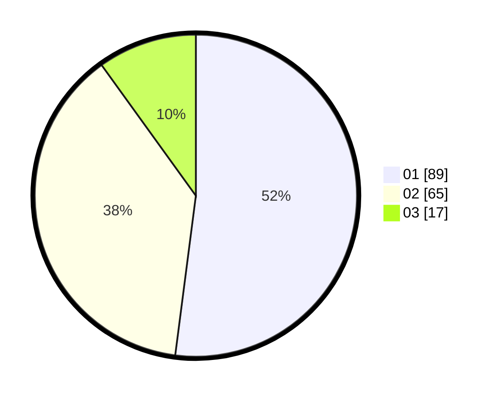

# Hasil

Hasil perolehan suara paslon dapat dilihat pada file paslon-01.txt, paslon-02.txt, dan paslon-03.txt.

Jika tidak ada, artinya data tersebut belum ada pada SIREKAP.

## Perolehan Suara

 * Paslon 01: **89**.
 * Paslon 02: **65**.
 * Paslon 03: **17**.

## Foto C Plano

https://sirekap-obj-formc.kpu.go.id/9da2/pemilu/ppwp/31/72/06/10/02/3172061002008-20240214-211915--d22cd099-a1fe-4ee9-8cc9-343eb16a7619.jpg

https://sirekap-obj-formc.kpu.go.id/9da2/pemilu/ppwp/31/72/06/10/02/3172061002008-20240215-154221--42e74a34-52d9-4f1b-b0f3-b40325a26eda.jpg

https://sirekap-obj-formc.kpu.go.id/9da2/pemilu/ppwp/31/72/06/10/02/3172061002008-20240214-211559--790a407b-9b9c-4661-8dd1-c4268b28d50d.jpg

## DATA PEMILIH TETAP

Jumlah pemilih dalam DPT: **199**.
 * L: **99**.
 * P: **100**.

## DATA PENGGUNA HAK PILIH

Jumlah pengguna hak pilih dalam DPT: **172**.
 * L: **85**.
 * P: **87**.

Jumlah pengguna hak pilih dalam DPTb: **0**.
 * L: **0**.
 * P: **0**.

Jumlah pengguna hak pilih dalam DPK: **0**.
 * L: **0**.
 * P: **0**.

Jumlah pengguna hak pilih: **172**.
 * L: **85**.
 * P: **87**.

## JUMLAH SUARA SAH DAN TIDAK SAH

JUMLAH SELURUH SUARA SAH: **171**.

JUMLAH SUARA TIDAK SAH: **1**.

JUMLAH SELURUH SUARA SAH DAN SUARA TIDAK SAH: **172**.
