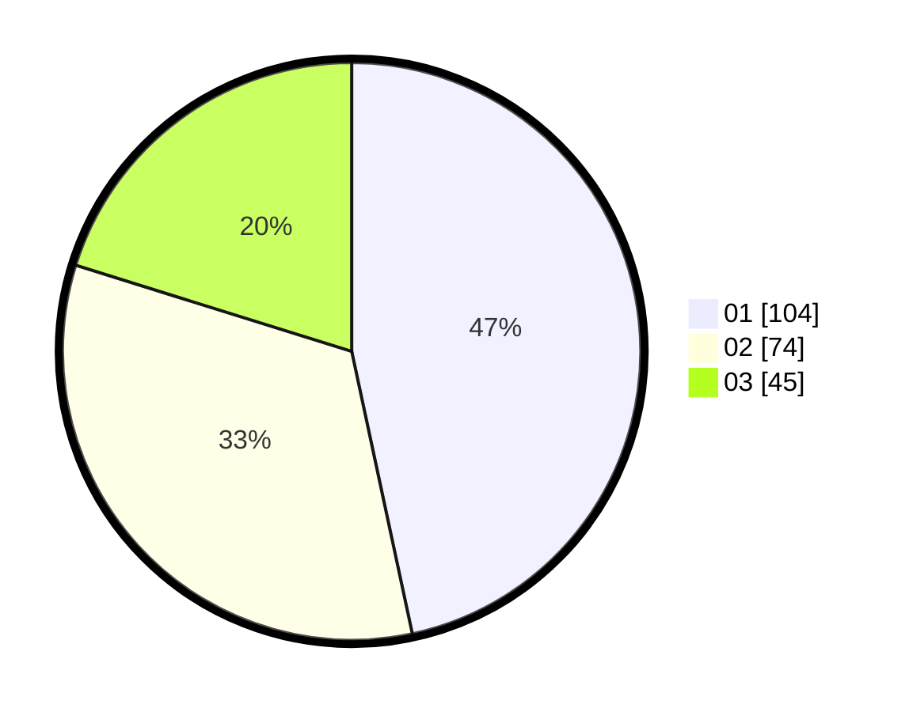

# Hasil

Hasil perolehan suara paslon dapat dilihat pada file paslon-01.txt, paslon-02.txt, dan paslon-03.txt.

Jika tidak ada, artinya data tersebut belum ada pada SIREKAP.

## Perolehan Suara

 * Paslon 01: **104**.
 * Paslon 02: **74**.
 * Paslon 03: **45**.

## Foto C Plano

https://sirekap-obj-formc.kpu.go.id/a1f8/pemilu/ppwp/31/72/06/10/02/3172061002053-20240214-201604--8e592fd4-a3d5-457d-b2dd-70aaba0d70a4.jpg

https://sirekap-obj-formc.kpu.go.id/a1f8/pemilu/ppwp/31/72/06/10/02/3172061002053-20240214-201935--75105176-b8fb-4219-910f-24a434016d13.jpg

https://sirekap-obj-formc.kpu.go.id/a1f8/pemilu/ppwp/31/72/06/10/02/3172061002053-20240214-202051--3357b58a-1c6d-45f1-9cb5-2c89ffea25e9.jpg

## DATA PEMILIH TETAP

Jumlah pemilih dalam DPT: **282**.
 * L: **143**.
 * P: **139**.

## DATA PENGGUNA HAK PILIH

Jumlah pengguna hak pilih dalam DPT: **216**.
 * L: **102**.
 * P: **114**.

Jumlah pengguna hak pilih dalam DPTb: **1**.
 * L: **0**.
 * P: **1**.

Jumlah pengguna hak pilih dalam DPK: **9**.
 * L: **6**.
 * P: **3**.

Jumlah pengguna hak pilih: **226**.
 * L: **108**.
 * P: **118**.

## JUMLAH SUARA SAH DAN TIDAK SAH

JUMLAH SELURUH SUARA SAH: **223**.

JUMLAH SUARA TIDAK SAH: **3**.

JUMLAH SELURUH SUARA SAH DAN SUARA TIDAK SAH: **226**.
