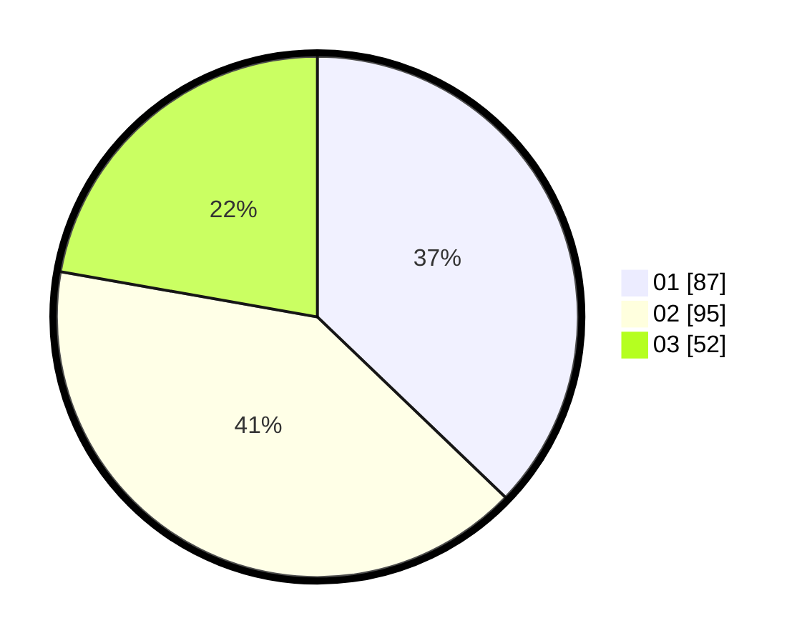

# Hasil

Hasil perolehan suara paslon dapat dilihat pada file paslon-01.txt, paslon-02.txt, dan paslon-03.txt.

Jika tidak ada, artinya data tersebut belum ada pada SIREKAP.

## Perolehan Suara

 * Paslon 01: **87**.
 * Paslon 02: **95**.
 * Paslon 03: **52**.

## Foto C Plano

https://sirekap-obj-formc.kpu.go.id/6422/pemilu/ppwp/31/72/06/10/02/3172061002054-20240215-000112--e67c517c-46f1-4e30-965e-6e523382d512.jpg

https://sirekap-obj-formc.kpu.go.id/6422/pemilu/ppwp/31/72/06/10/02/3172061002054-20240215-000217--7649d80d-a9ee-4610-986a-729f9749d846.jpg

https://sirekap-obj-formc.kpu.go.id/6422/pemilu/ppwp/31/72/06/10/02/3172061002054-20240215-000308--722b6090-56a1-420a-b0d4-9b2f9751c1f6.jpg

## DATA PEMILIH TETAP

Jumlah pemilih dalam DPT: **280**.
 * L: **138**.
 * P: **142**.

## DATA PENGGUNA HAK PILIH

Jumlah pengguna hak pilih dalam DPT: **234**.
 * L: **114**.
 * P: **120**.

Jumlah pengguna hak pilih dalam DPTb: **1**.
 * L: **0**.
 * P: **1**.

Jumlah pengguna hak pilih dalam DPK: **1**.
 * L: **0**.
 * P: **1**.

Jumlah pengguna hak pilih: **236**.
 * L: **114**.
 * P: **122**.

## JUMLAH SUARA SAH DAN TIDAK SAH

JUMLAH SELURUH SUARA SAH: **234**.

JUMLAH SUARA TIDAK SAH: **2**.

JUMLAH SELURUH SUARA SAH DAN SUARA TIDAK SAH: **236**.
