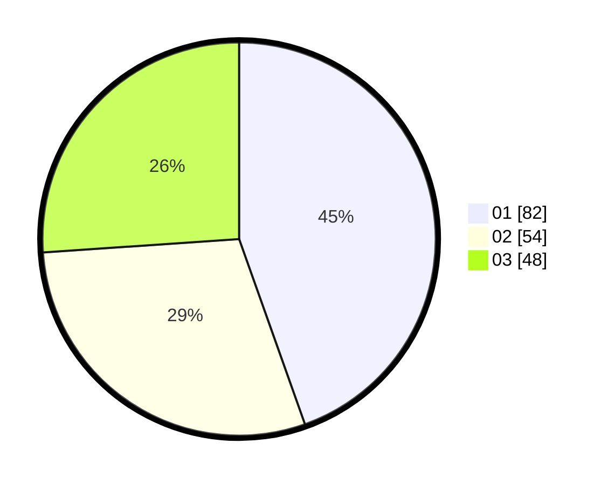

# Hasil

Hasil perolehan suara paslon dapat dilihat pada file paslon-01.txt, paslon-02.txt, dan paslon-03.txt.

Jika tidak ada, artinya data tersebut belum ada pada SIREKAP.

## Perolehan Suara

 * Paslon 01: **82**.
 * Paslon 02: **54**.
 * Paslon 03: **48**.

## Foto C Plano

https://sirekap-obj-formc.kpu.go.id/4745/pemilu/ppwp/31/72/06/10/02/3172061002056-20240215-114310--854617fd-8611-48f9-9ebf-33ce08205dda.jpg

https://sirekap-obj-formc.kpu.go.id/4745/pemilu/ppwp/31/72/06/10/02/3172061002056-20240215-114314--ca229b4e-5932-4742-a211-4f2368e71e44.jpg

https://sirekap-obj-formc.kpu.go.id/4745/pemilu/ppwp/31/72/06/10/02/3172061002056-20240215-114318--a279668a-f893-4406-bf90-7776ac778a1d.jpg

## DATA PEMILIH TETAP

Jumlah pemilih dalam DPT: **283**.
 * L: **146**.
 * P: **137**.

## DATA PENGGUNA HAK PILIH

Jumlah pengguna hak pilih dalam DPT: **197**.
 * L: **100**.
 * P: **97**.

Jumlah pengguna hak pilih dalam DPTb: **0**.
 * L: **0**.
 * P: **0**.

Jumlah pengguna hak pilih dalam DPK: **0**.
 * L: **0**.
 * P: **0**.

Jumlah pengguna hak pilih: **197**.
 * L: **100**.
 * P: **97**.

## JUMLAH SUARA SAH DAN TIDAK SAH

JUMLAH SELURUH SUARA SAH: **194**.

JUMLAH SUARA TIDAK SAH: **3**.

JUMLAH SELURUH SUARA SAH DAN SUARA TIDAK SAH: **197**.
