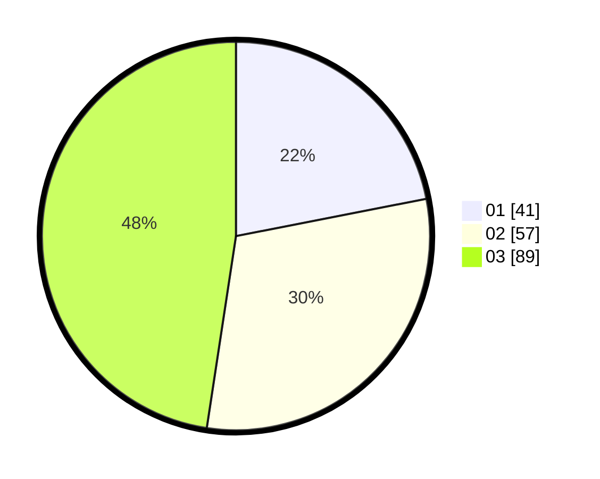

# Hasil

Hasil perolehan suara paslon dapat dilihat pada file paslon-01.txt, paslon-02.txt, dan paslon-03.txt.

Jika tidak ada, artinya data tersebut belum ada pada SIREKAP.

## Perolehan Suara

 * Paslon 01: **41**.
 * Paslon 02: **57**.
 * Paslon 03: **89**.

## Foto C Plano

https://sirekap-obj-formc.kpu.go.id/6ba4/pemilu/ppwp/31/72/06/10/02/3172061002068-20240214-195228--32f6714c-5fb3-49d4-9784-28f6a0a3cd75.jpg

https://sirekap-obj-formc.kpu.go.id/6ba4/pemilu/ppwp/31/72/06/10/02/3172061002068-20240214-191927--cb4ebab7-4fd5-480f-ae4b-cde9f20f013a.jpg

https://sirekap-obj-formc.kpu.go.id/6ba4/pemilu/ppwp/31/72/06/10/02/3172061002068-20240214-191922--046f6095-c783-460f-bf0e-d771df9e71e7.jpg
