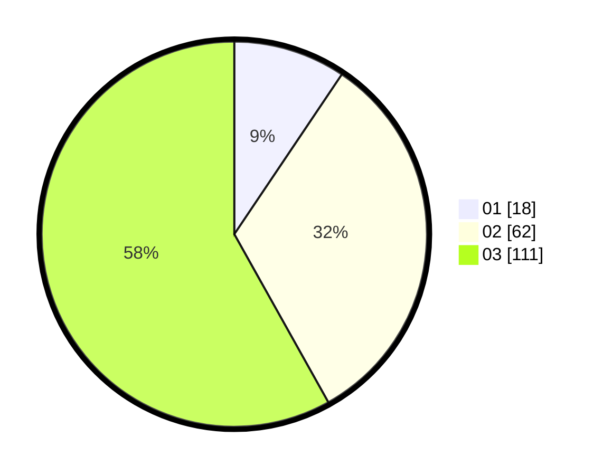

# Hasil

Hasil perolehan suara paslon dapat dilihat pada file paslon-01.txt, paslon-02.txt, dan paslon-03.txt.

Jika tidak ada, artinya data tersebut belum ada pada SIREKAP.

## Perolehan Suara

 * Paslon 01: **18**.
 * Paslon 02: **62**.
 * Paslon 03: **111**.

## Foto C Plano

https://sirekap-obj-formc.kpu.go.id/9fa3/pemilu/ppwp/31/72/06/10/02/3172061002139-20240215-013623--1a8a7e1c-c8f5-4778-bc5d-4a6c5c8cf4f8.jpg

https://sirekap-obj-formc.kpu.go.id/9fa3/pemilu/ppwp/31/72/06/10/02/3172061002139-20240215-013636--f42623a5-9d93-4bdc-bd4f-784c3b4c7e5c.jpg

https://sirekap-obj-formc.kpu.go.id/9fa3/pemilu/ppwp/31/72/06/10/02/3172061002139-20240215-013639--c7219260-5163-4669-b46b-facffe35c65d.jpg

## DATA PEMILIH TETAP

Jumlah pemilih dalam DPT: **253**.
 * L: **122**.
 * P: **131**.

## DATA PENGGUNA HAK PILIH

Jumlah pengguna hak pilih dalam DPT: **181**.
 * L: **88**.
 * P: **93**.

Jumlah pengguna hak pilih dalam DPTb: **9**.
 * L: **3**.
 * P: **6**.

Jumlah pengguna hak pilih dalam DPK: **1**.
 * L: **0**.
 * P: **1**.

Jumlah pengguna hak pilih: **191**.
 * L: **91**.
 * P: **100**.

## JUMLAH SUARA SAH DAN TIDAK SAH
