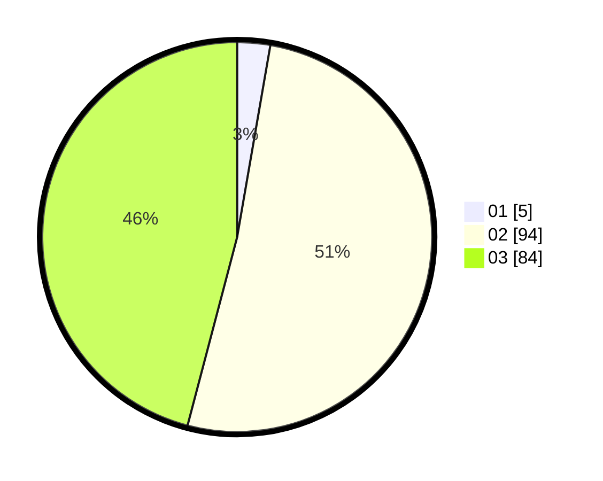

# Hasil

Hasil perolehan suara paslon dapat dilihat pada file paslon-01.txt, paslon-02.txt, dan paslon-03.txt.

Jika tidak ada, artinya data tersebut belum ada pada SIREKAP.

## Perolehan Suara

 * Paslon 01: **5**.
 * Paslon 02: **94**.
 * Paslon 03: **84**.

## Foto C Plano

https://sirekap-obj-formc.kpu.go.id/7c02/pemilu/ppwp/31/72/06/10/02/3172061002144-20240214-192344--778facba-b05c-47e8-b363-97b503d3d529.jpg

https://sirekap-obj-formc.kpu.go.id/7c02/pemilu/ppwp/31/72/06/10/02/3172061002144-20240214-192434--28ca467e-c678-4f54-a7dd-fc1c377f9e8a.jpg

https://sirekap-obj-formc.kpu.go.id/7c02/pemilu/ppwp/31/72/06/10/02/3172061002144-20240214-192529--7aa84dfd-e4d7-4ed3-8200-f9ae62852638.jpg

## DATA PEMILIH TETAP

Jumlah pemilih dalam DPT: **258**.
 * L: **126**.
 * P: **132**.

## DATA PENGGUNA HAK PILIH

Jumlah pengguna hak pilih dalam DPT: **178**.
 * L: **90**.
 * P: **88**.

Jumlah pengguna hak pilih dalam DPTb: **4**.
 * L: **2**.
 * P: **2**.

Jumlah pengguna hak pilih dalam DPK: **3**.
 * L: **1**.
 * P: **2**.

Jumlah pengguna hak pilih: **185**.
 * L: **93**.
 * P: **92**.

## JUMLAH SUARA SAH DAN TIDAK SAH

JUMLAH SELURUH SUARA SAH: **183**.

JUMLAH SUARA TIDAK SAH: **2**.

JUMLAH SELURUH SUARA SAH DAN SUARA TIDAK SAH: **185**.
