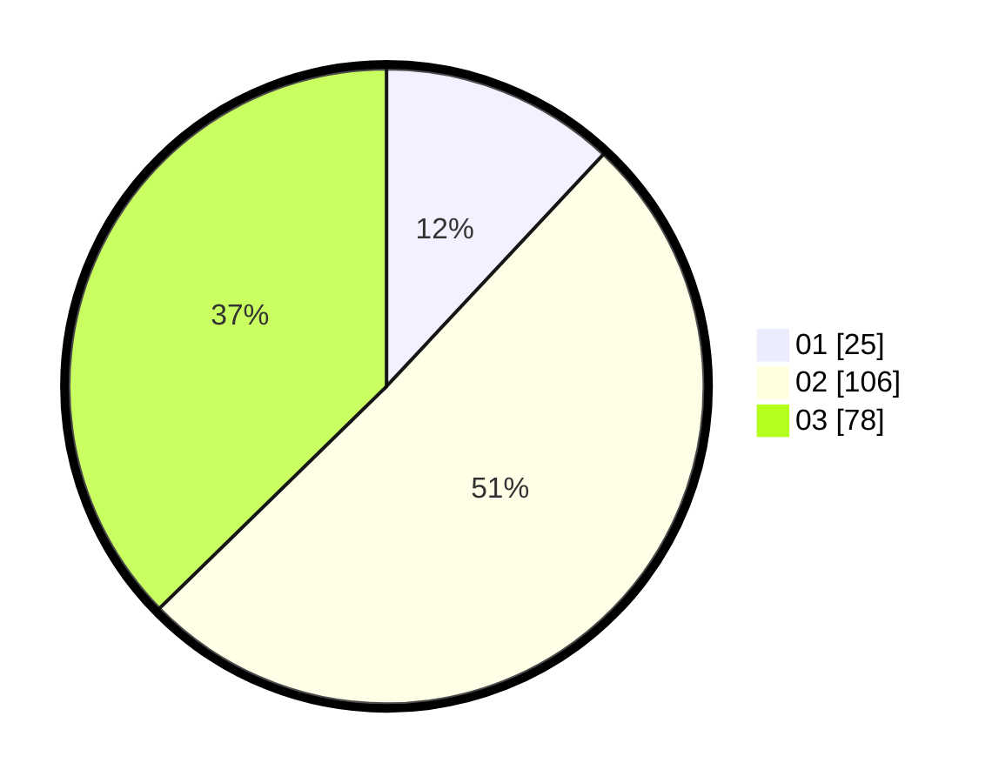

# Hasil

Hasil perolehan suara paslon dapat dilihat pada file paslon-01.txt, paslon-02.txt, dan paslon-03.txt.

Jika tidak ada, artinya data tersebut belum ada pada SIREKAP.

## Perolehan Suara

 * Paslon 01: **25**.
 * Paslon 02: **106**.
 * Paslon 03: **78**.

## Foto C Plano

https://sirekap-obj-formc.kpu.go.id/17d4/pemilu/ppwp/31/72/06/10/02/3172061002163-20240214-201612--a4f9b776-2ad6-4eb7-bea4-f5aefc0c0a24.jpg

https://sirekap-obj-formc.kpu.go.id/17d4/pemilu/ppwp/31/72/06/10/02/3172061002163-20240214-201647--53ed7230-8dda-49f9-8d5f-c29446ca10d0.jpg

https://sirekap-obj-formc.kpu.go.id/17d4/pemilu/ppwp/31/72/06/10/02/3172061002163-20240214-201739--1a6a29f0-eaea-4bed-bf59-1d371616e641.jpg

## DATA PEMILIH TETAP

Jumlah pemilih dalam DPT: **282**.
 * L: **120**.
 * P: **162**.

## DATA PENGGUNA HAK PILIH

Jumlah pengguna hak pilih dalam DPT: **181**.
 * L: **74**.
 * P: **107**.

Jumlah pengguna hak pilih dalam DPTb: **17**.
 * L: **8**.
 * P: **9**.

Jumlah pengguna hak pilih dalam DPK: **13**.
 * L: **4**.
 * P: **9**.

Jumlah pengguna hak pilih: **211**.
 * L: **86**.
 * P: **125**.

## JUMLAH SUARA SAH DAN TIDAK SAH

JUMLAH SELURUH SUARA SAH: **209**.

JUMLAH SUARA TIDAK SAH: **2**.

JUMLAH SELURUH SUARA SAH DAN SUARA TIDAK SAH: **211**.
