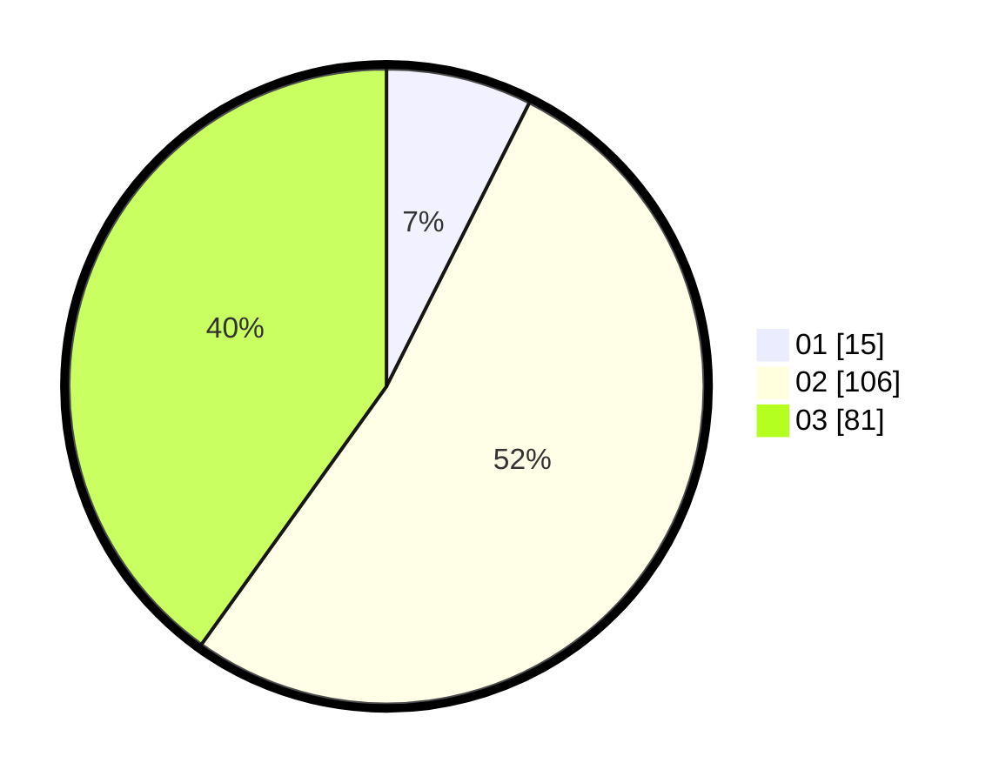

# Hasil

Hasil perolehan suara paslon dapat dilihat pada file paslon-01.txt, paslon-02.txt, dan paslon-03.txt.

Jika tidak ada, artinya data tersebut belum ada pada SIREKAP.

## Perolehan Suara

 * Paslon 01: **15**.
 * Paslon 02: **106**.
 * Paslon 03: **81**.

## Foto C Plano

https://sirekap-obj-formc.kpu.go.id/632e/pemilu/ppwp/31/72/06/10/02/3172061002165-20240214-185213--483037a4-2752-4b14-85a1-6937284240ab.jpg

https://sirekap-obj-formc.kpu.go.id/632e/pemilu/ppwp/31/72/06/10/02/3172061002165-20240216-202935--c19ce97f-3d23-4350-8190-13184ef92d83.jpg

https://sirekap-obj-formc.kpu.go.id/632e/pemilu/ppwp/31/72/06/10/02/3172061002165-20240214-185222--6add4379-d843-4f30-aca8-63a6eccb8082.jpg

## DATA PEMILIH TETAP

Jumlah pemilih dalam DPT: **265**.
 * L: **119**.
 * P: **146**.

## DATA PENGGUNA HAK PILIH

Jumlah pengguna hak pilih dalam DPT: **163**.
 * L: **74**.
 * P: **89**.

Jumlah pengguna hak pilih dalam DPTb: **8**.
 * L: **2**.
 * P: **6**.

Jumlah pengguna hak pilih dalam DPK: **32**.
 * L: **15**.
 * P: **17**.

Jumlah pengguna hak pilih: **203**.
 * L: **91**.
 * P: **112**.

## JUMLAH SUARA SAH DAN TIDAK SAH

JUMLAH SELURUH SUARA SAH: **202**.

JUMLAH SUARA TIDAK SAH: **1**.

JUMLAH SELURUH SUARA SAH DAN SUARA TIDAK SAH: **203**.
