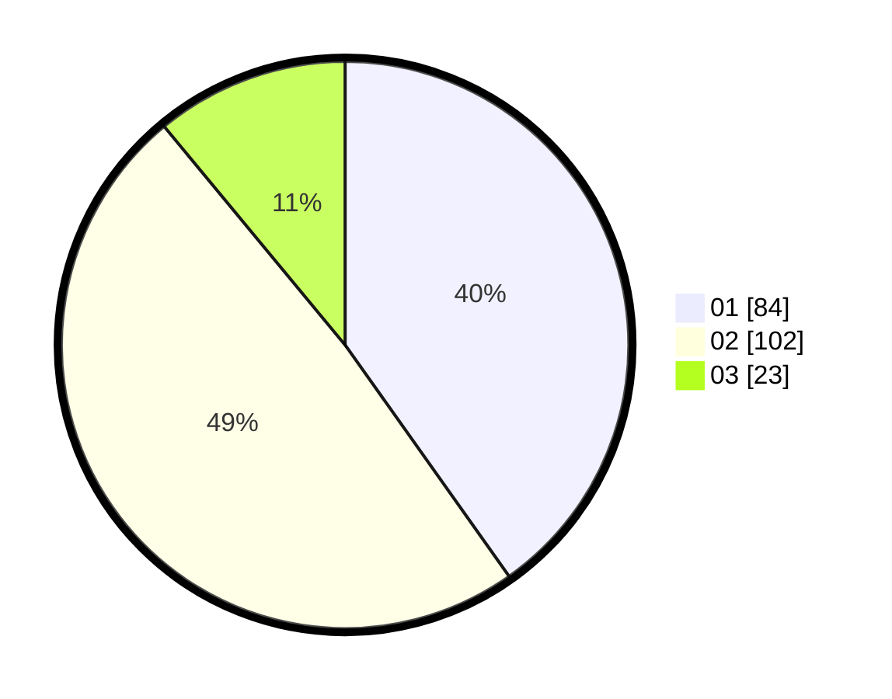

# Hasil

Hasil perolehan suara paslon dapat dilihat pada file paslon-01.txt, paslon-02.txt, dan paslon-03.txt.

Jika tidak ada, artinya data tersebut belum ada pada SIREKAP.

## Perolehan Suara

 * Paslon 01: **84**.
 * Paslon 02: **102**.
 * Paslon 03: **23**.

## Foto C Plano

https://sirekap-obj-formc.kpu.go.id/d69e/pemilu/ppwp/31/72/06/10/03/3172061003001-20240214-193733--3136987a-b542-4d21-8621-ad5ba17de5bb.jpg

https://sirekap-obj-formc.kpu.go.id/d69e/pemilu/ppwp/31/72/06/10/03/3172061003001-20240214-193104--13cc5248-8fd7-4c95-921b-db417440f4a0.jpg

https://sirekap-obj-formc.kpu.go.id/d69e/pemilu/ppwp/31/72/06/10/03/3172061003001-20240214-193337--f5602ed6-e9e7-48b0-aa24-220288ae88d8.jpg

## DATA PEMILIH TETAP

Jumlah pemilih dalam DPT: **213**.
 * L: **92**.
 * P: **121**.

## DATA PENGGUNA HAK PILIH

Jumlah pengguna hak pilih dalam DPT: **199**.
 * L: **83**.
 * P: **116**.

Jumlah pengguna hak pilih dalam DPTb: **12**.
 * L: **8**.
 * P: **4**.

Jumlah pengguna hak pilih dalam DPK: **2**.
 * L: **1**.
 * P: **1**.

Jumlah pengguna hak pilih: **213**.
 * L: **92**.
 * P: **121**.

## JUMLAH SUARA SAH DAN TIDAK SAH

JUMLAH SELURUH SUARA SAH: **209**.

JUMLAH SUARA TIDAK SAH: **4**.

JUMLAH SELURUH SUARA SAH DAN SUARA TIDAK SAH: **213**.
