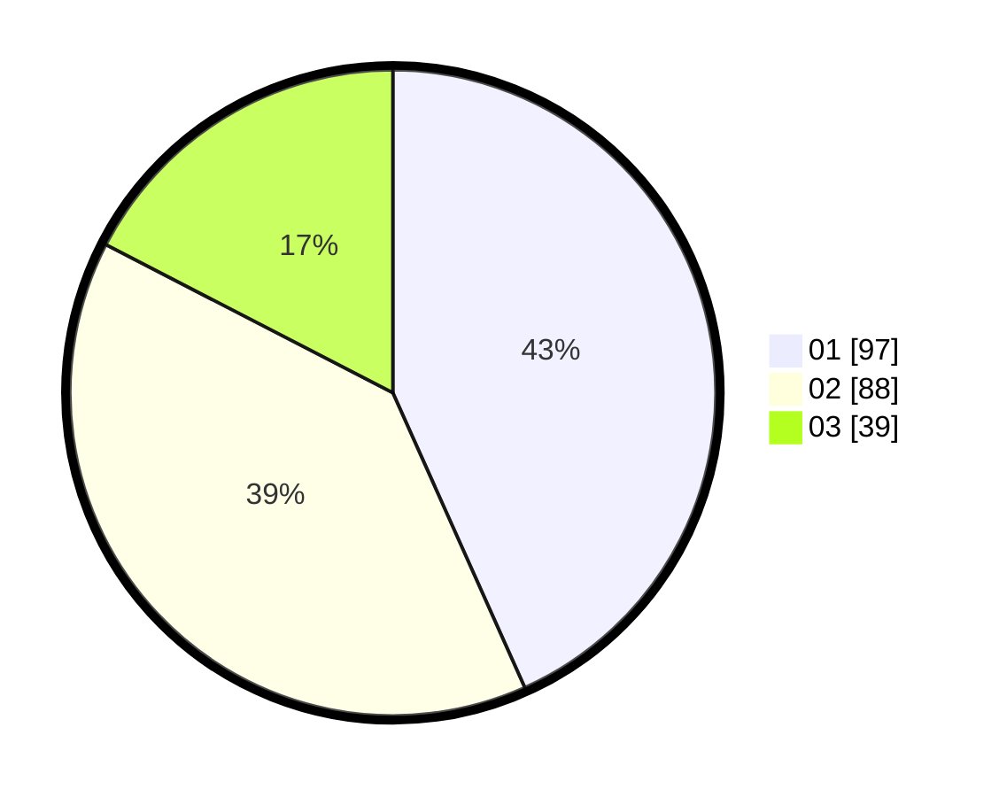

# Hasil

Hasil perolehan suara paslon dapat dilihat pada file paslon-01.txt, paslon-02.txt, dan paslon-03.txt.

Jika tidak ada, artinya data tersebut belum ada pada SIREKAP.

## Perolehan Suara

 * Paslon 01: **97**.
 * Paslon 02: **88**.
 * Paslon 03: **39**.

## Foto C Plano

https://sirekap-obj-formc.kpu.go.id/daab/pemilu/ppwp/31/72/06/10/03/3172061003005-20240214-225308--9087cff7-568f-4681-b1f5-1fb8898a5656.jpg

https://sirekap-obj-formc.kpu.go.id/daab/pemilu/ppwp/31/72/06/10/03/3172061003005-20240214-225142--e86a646f-4471-4469-be36-30084fac481b.jpg

https://sirekap-obj-formc.kpu.go.id/daab/pemilu/ppwp/31/72/06/10/03/3172061003005-20240214-200525--714bbaad-1d36-4635-b08b-29a1c932f73f.jpg

## DATA PEMILIH TETAP

Jumlah pemilih dalam DPT: **285**.
 * L: **124**.
 * P: **161**.

## DATA PENGGUNA HAK PILIH

Jumlah pengguna hak pilih dalam DPT: **218**.
 * L: **94**.
 * P: **124**.

Jumlah pengguna hak pilih dalam DPTb: **11**.
 * L: **5**.
 * P: **6**.

Jumlah pengguna hak pilih dalam DPK: **2**.
 * L: **1**.
 * P: **1**.

Jumlah pengguna hak pilih: **231**.
 * L: **100**.
 * P: **131**.

## JUMLAH SUARA SAH DAN TIDAK SAH

JUMLAH SELURUH SUARA SAH: **224**.

JUMLAH SUARA TIDAK SAH: **7**.

JUMLAH SELURUH SUARA SAH DAN SUARA TIDAK SAH: **231**.
