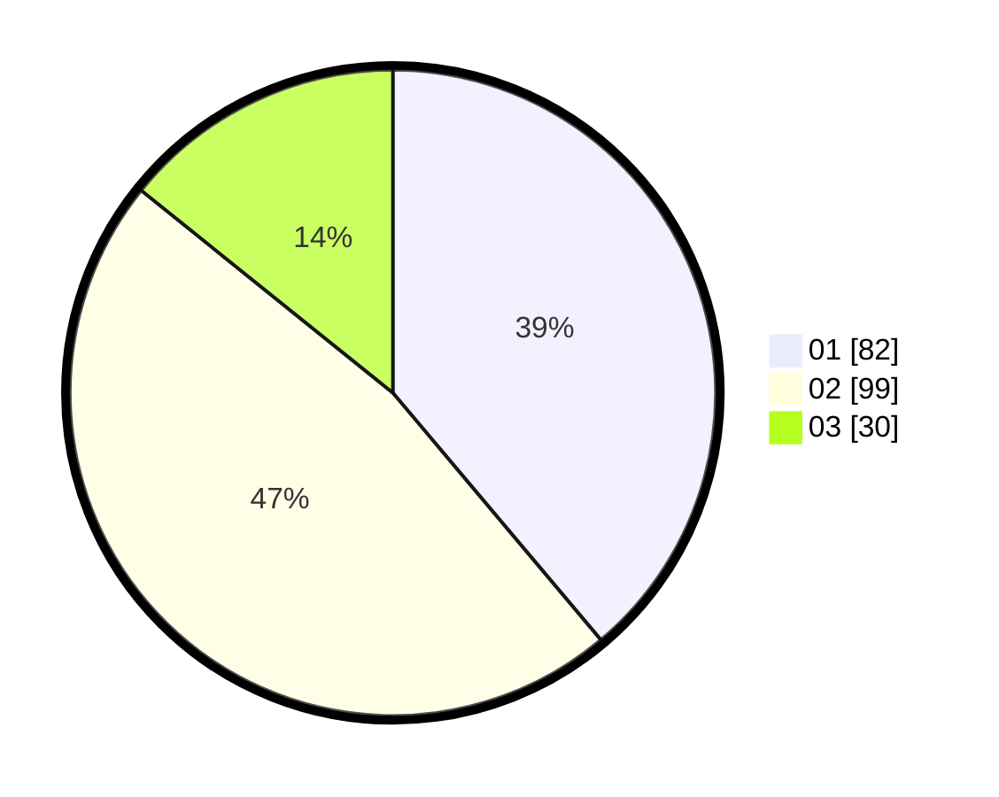

# Hasil

Hasil perolehan suara paslon dapat dilihat pada file paslon-01.txt, paslon-02.txt, dan paslon-03.txt.

Jika tidak ada, artinya data tersebut belum ada pada SIREKAP.

## Perolehan Suara

 * Paslon 01: **82**.
 * Paslon 02: **99**.
 * Paslon 03: **30**.

## Foto C Plano

https://sirekap-obj-formc.kpu.go.id/dc36/pemilu/ppwp/31/72/06/10/03/3172061003006-20240214-224100--a72d2fa9-d970-48cc-8f89-1fbaebcedcad.jpg

https://sirekap-obj-formc.kpu.go.id/dc36/pemilu/ppwp/31/72/06/10/03/3172061003006-20240214-230912--fa60afb1-f046-4b26-b216-c3966b651d89.jpg

https://sirekap-obj-formc.kpu.go.id/dc36/pemilu/ppwp/31/72/06/10/03/3172061003006-20240214-231209--391cb7ae-7b35-44d5-8278-a6588ea3e7f2.jpg
