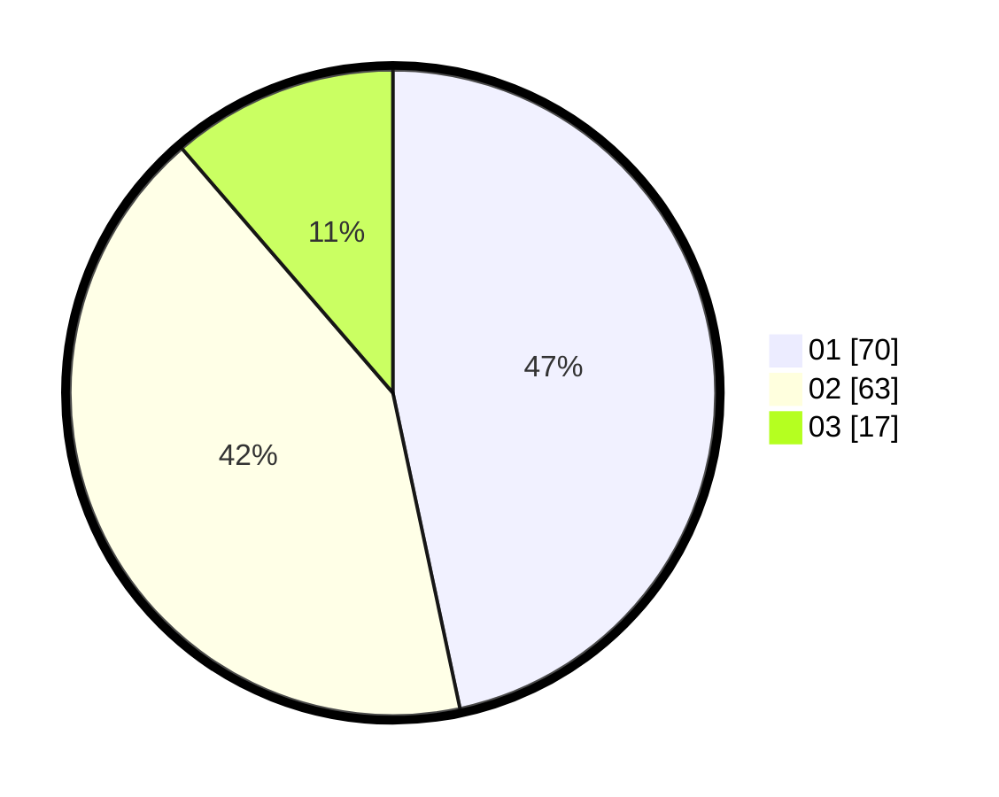

# Hasil

Hasil perolehan suara paslon dapat dilihat pada file paslon-01.txt, paslon-02.txt, dan paslon-03.txt.

Jika tidak ada, artinya data tersebut belum ada pada SIREKAP.

## Perolehan Suara

 * Paslon 01: **70**.
 * Paslon 02: **63**.
 * Paslon 03: **17**.

## Foto C Plano

https://sirekap-obj-formc.kpu.go.id/4d26/pemilu/ppwp/31/72/06/10/03/3172061003008-20240219-122934--fdeb29df-32a9-46fe-8390-d6c9b1c99a3f.jpg

https://sirekap-obj-formc.kpu.go.id/4d26/pemilu/ppwp/31/72/06/10/03/3172061003008-20240219-122936--d23538da-1329-4e01-afb8-fc1997083324.jpg

https://sirekap-obj-formc.kpu.go.id/4d26/pemilu/ppwp/31/72/06/10/03/3172061003008-20240219-122935--7463ab90-7196-437c-8770-0082f87800b0.jpg

## DATA PEMILIH TETAP

Jumlah pemilih dalam DPT: **224**.
 * L: **102**.
 * P: **122**.

## DATA PENGGUNA HAK PILIH

Jumlah pengguna hak pilih dalam DPT: **144**.
 * L: **66**.
 * P: **78**.

Jumlah pengguna hak pilih dalam DPTb: **6**.
 * L: **0**.
 * P: **6**.

Jumlah pengguna hak pilih dalam DPK: **1**.
 * L: **1**.
 * P: **0**.

Jumlah pengguna hak pilih: **151**.
 * L: **67**.
 * P: **84**.

## JUMLAH SUARA SAH DAN TIDAK SAH

JUMLAH SELURUH SUARA SAH: **150**.

JUMLAH SUARA TIDAK SAH: **1**.

JUMLAH SELURUH SUARA SAH DAN SUARA TIDAK SAH: **151**.
