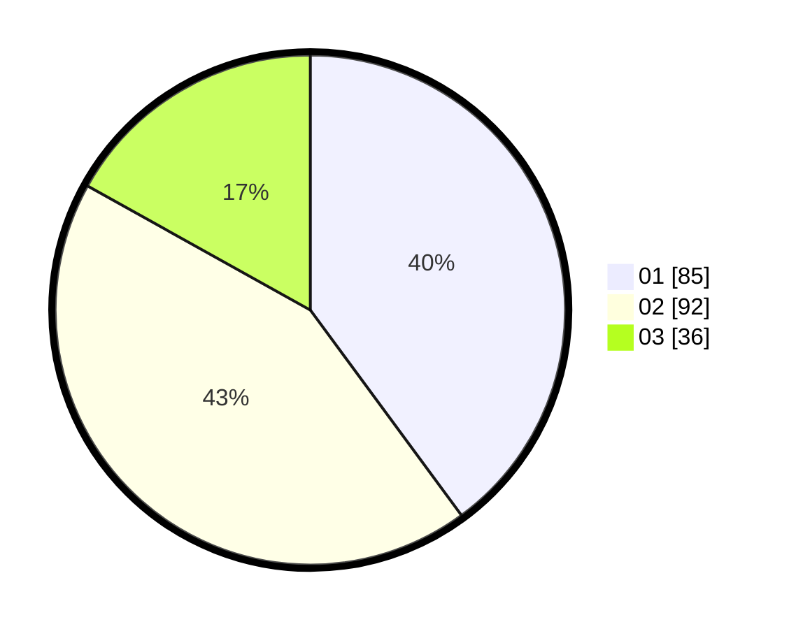

# Hasil

Hasil perolehan suara paslon dapat dilihat pada file paslon-01.txt, paslon-02.txt, dan paslon-03.txt.

Jika tidak ada, artinya data tersebut belum ada pada SIREKAP.

## Perolehan Suara

 * Paslon 01: **85**.
 * Paslon 02: **92**.
 * Paslon 03: **36**.

## Foto C Plano

https://sirekap-obj-formc.kpu.go.id/b154/pemilu/ppwp/31/72/06/10/03/3172061003014-20240216-123108--7325472d-79ab-4a13-88c9-5e40ce50d1f2.jpg

https://sirekap-obj-formc.kpu.go.id/b154/pemilu/ppwp/31/72/06/10/03/3172061003014-20240216-123952--470ca6fd-115e-4d86-b535-b2787f6c14ee.jpg

https://sirekap-obj-formc.kpu.go.id/b154/pemilu/ppwp/31/72/06/10/03/3172061003014-20240216-124533--fda6a9f4-42ee-40ce-9ec7-31ac8fa3865e.jpg

## DATA PEMILIH TETAP

Jumlah pemilih dalam DPT: **281**.
 * L: **125**.
 * P: **156**.

## DATA PENGGUNA HAK PILIH

Jumlah pengguna hak pilih dalam DPT: **210**.
 * L: **91**.
 * P: **119**.

Jumlah pengguna hak pilih dalam DPTb: **2**.
 * L: **1**.
 * P: **1**.

Jumlah pengguna hak pilih dalam DPK: **2**.
 * L: **1**.
 * P: **1**.

Jumlah pengguna hak pilih: **214**.
 * L: **93**.
 * P: **121**.

## JUMLAH SUARA SAH DAN TIDAK SAH

JUMLAH SELURUH SUARA SAH: **213**.

JUMLAH SUARA TIDAK SAH: **1**.

JUMLAH SELURUH SUARA SAH DAN SUARA TIDAK SAH: **214**.
